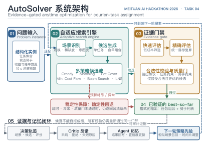

<div align="center">
  <h1>AutoSolver</h1>
  <p><strong>让 AI Agent 自主求解配送分配问题</strong></p>
  <p>美团 AI Hackathon 2026 · 命题赛道 · 赛题 04「AutoSolver」</p>
  <p>
    <a href="#快速开始"></a>
    <a href="https://github.com/XxJjTt6/AutoSolver"></a>
    <a href="https://www.python.org/"></a>
    <a href="LICENSE"></a>
  </p>
  <p>Python 3.10+ · 标准库可运行 · 多策略搜索 · 约束校验 · 决策追踪 · 长期记忆</p>
</div>

---

> **本地 Demo（推荐先体验）：`http://127.0.0.1:8799`**
>
> 无需登录、无需 API Key、无需安装第三方依赖。启动后可在同一订单流上同步对比“最近距离贪心”与 AutoSolver，继续下钻每轮决策、长期记忆、订单池和骑手运力。
> 启动方法见 [快速开始](#快速开始)。

---

## 目录

- [一句话定位](#一句话定位)
- [这是什么](#这是什么)
- [为什么需要 AutoSolver](#为什么需要-autosolver)
- [核心创新](#核心创新)
- [系统架构](#系统架构)
- [功能全景](#功能全景)
- [与最近距离贪心对比](#与最近距离贪心对比)
- [关键技术原理](#关键技术原理)
- [快速开始](#快速开始)
- [现场演示清单](#现场演示清单)
- [项目结构](#项目结构)
- [技术栈](#技术栈)
- [评测与验证](#评测与验证)
- [数据与结果边界](#数据与结果边界)
- [文档与许可证](#文档与许可证)

---

## 一句话定位

> 普通派单只回答“谁离得最近”；AutoSolver 回答“此刻谁接哪一组订单，能让更多订单被稳定接起，同时控制成本与后续风险”。
>
> 它不是把某一种算法写死，而是让 Agent **主动尝试策略、统一评估结果、淘汰无效方案，并在时限内交出当前最优合法解**。

## 这是什么

外卖配送不是简单的最近邻匹配。一个真实调度轮次同时包含订单组合、可用骑手、预计算分数、骑手接单意愿和合单机会；同一订单可派给多位骑手，最终由最先接单者获得任务。系统需要在有限时间内兼顾接单规模、综合得分和资源利用率。

AutoSolver 为这类问题提供两条互相校验的链路：

| 链路 | 入口 | 作用 |
|---|---|---|
| 比赛求解器 | `solver.py` | 解析候选表，在时间预算内输出合法的任务与骑手分配结果。 |
| 可解释工作台 | `web_agent_demo/server_v9.py` | 用同一订单流对比基线与 AutoSolver，并展示决策依据和经验复用过程。 |

| 会求解 | 会解释 | 会进化 |
|:---:|:---:|:---:|
| 多策略并行竞争<br>持续保留当前最优解 | 从触发、过滤到评分<br>完整还原决策链 | 记录场景与反馈<br>为相似轮次复用经验 |

## 为什么需要 AutoSolver

配送分配看似只是“订单给谁”，真正困难的是四类耦合问题：

- **最近不等于最优**：当前取餐距离更短，可能换来后续排队、超时或区域运力失衡。
- **合单改变全局**：把两个顺路订单交给同一骑手，可能释放稀缺运力，也可能造成新的时间风险。
- **接单意愿有不确定性**：候选分数之外，还要考虑不同骑手实际接受任务的概率。
- **求解时间受限制**：搜索空间快速膨胀，但系统必须在比赛规定的时限内稳定输出。

> 用户需要的不是一个“看起来聪明”的单次答案，而是一套能验证合法性、比较优劣、超时可回退的求解闭环。

## 核心创新

六项能力不是彼此孤立的功能，而是一条完整链路：**识别场景 → 生成候选 → 多策略求解 → 双层评估 → 合法性门禁 → 反馈进化**。

| # | 创新点 | 一句话说明 |
|---|---|---|
| 01 | **场景自适应** | 根据任务规模、运力稀缺度、平均意愿度和组合任务特征，动态选择更合适的搜索路径。 |
| 02 | **多策略竞争** | 组合贪心、匹配、稀疏覆盖、列搜索、最小费用流、LNS 和局部修复，不押注单一算法。 |
| 03 | **双层评估** | 先用快速评估器筛选候选，再用精确评估与统一目标比较结果，减少无效搜索。 |
| 04 | **合法性门禁** | 对任务、骑手、候选行和输出协议做一致性检查，非法候选不会进入最终答案。 |
| 05 | **限时最优与回退** | 在固定预算内持续保存 best-so-far；异常、超时或质量门未通过时切换确定性回退。 |
| 06 | **决策记忆闭环** | 记录场景、候选、采纳原因与结果反馈，让后续相似轮次能够召回并调整策略。 |

## 系统架构

<p align="center">
  
</p>

> 图中实线表示当前轮求解与验证路径，虚线表示异常回退、可审计证据和下一轮策略先验。图稿同时提供 [PDF 矢量版](docs/assets/autosolver-system-architecture-v1.pdf) 和 [600 DPI PNG](docs/assets/autosolver-system-architecture-v1.png)。

对应到代码目录：

| 层 | 主要模块 | 职责 |
|---|---|---|
| 接口层 | `solver.py`、`solution.py` | 兼容比赛评测导入方式，接收文本并返回规定格式。 |
| 求解层 | `autosolver/` | 候选生成、贪心、匹配、列搜索、LNS、评估、校验与回退。 |
| Agent 层 | `autosolver_agent/` | 策略编排、Critic、可选 LLM 生成、质量门和演化记忆。 |
| 仿真层 | `web_agent_demo/` | 全天订单流、路线、骑手状态、基线对照和五页工作台。 |
| 证据层 | `tests/`、`_bench.py` | 契约测试、确定性回归与本地代理指标。 |

## 功能全景

### 第一幕：在时限内求出合法方案

1. 解析任务组合、骑手、分数和意愿度。
2. 识别当前属于小规模、运力稀缺、低意愿或高组合度场景。
3. 让多种求解策略在各自时间片内生成候选方案。
4. 统一比较候选，持续更新当前最优合法解。
5. 在预算耗尽前格式化输出；任何异常都有确定性回退兜底。

### 第二幕：把“为什么这样派”展示出来

- **双屏对比**：两侧共享订单流、骑手初态和推演时钟，只改变调度策略。
- **决策过程**：查看触发原因、候选骑手、过滤过程、策略评分、采纳与放弃原因。
- **订单与运力**：订单只在真实下单时刻后出现，骑手状态随班次、位置和任务链变化。

### 第三幕：把结果变成下一轮经验

- **Read**：按时段、区域压力、订单风险和运力状态召回相似经验。
- **Decide**：将经验注入本轮候选比较，而不是直接替代合法性判断。
- **Write**：把实际结果、收益和失败原因回写经验库。
- **Reflect**：沉淀全局策略、骑手画像、商圈画像和订单风险画像。

## 与最近距离贪心对比

同一批订单、同一批骑手、同一条推演时间轴，只替换决策方法：

| 能力维度 | 最近距离贪心 | AutoSolver |
|---|:---:|:---:|
| 当前取餐距离 | 主要依据 | 综合依据之一 |
| 接单意愿与任务收益 | 不完整考虑 | 统一进入候选评估 |
| 合单与全局运力 | 局部处理 | 多策略联合搜索 |
| 超时与后续风险 | 被动暴露 | 候选阶段评估 |
| 方案合法性复核 | 基础规则 | 独立校验门禁 |
| 决策原因追溯 | 不支持 | 支持完整链路 |
| 历史经验复用 | 不支持 | 支持读写与反馈 |
| 异常和超时回退 | 单一路径 | best-so-far + 确定性回退 |

## 关键技术原理

### 1. 场景驱动，而不是固定算法

AutoSolver 先统计任务数、骑手数、候选密度、平均意愿度和组合任务分布，再决定给不同算法分配多少时间。小规模问题可以做更深的列搜索；运力稀缺时优先覆盖和组合优化；低意愿场景则强化概率与成本之间的平衡。

### 2. 多策略产生候选，统一标准决定去留

贪心、匹配、set cover、min-cost flow、beam search 和 LNS 负责“提出答案”，评估器与校验器负责“相信哪个答案”。候选策略不能自报成绩，只有通过统一目标比较与约束校验后，才有机会替换当前最优解。

### 3. 时间预算内持续保存 best-so-far

系统不会等所有搜索结束后才第一次得到结果。确定性基线先提供可用解，后续策略只负责尝试改进；当时间不足时直接返回已经验证的最好方案，从而把求解质量和稳定输出同时纳入设计。

### 4. 记忆只提供经验，不绕过门禁

历史经验可以帮助选择策略和判断风险，但不会直接成为最终答案。任何召回或生成的候选仍需经过相同的评估、合法性和时间预算检查，避免“记住一次成功”演变成不可验证的硬编码结果。

## 快速开始

**环境要求：** Python 3.10 或更高版本。核心求解器和本地工作台使用 Python 标准库，启动不需要 API Key，也不需要执行 `pip install`。

```bash
# 克隆仓库。
git clone https://github.com/XxJjTt6/AutoSolver.git

# 进入项目根目录。
cd AutoSolver

# 启动当前最终版 v9 调度工作台。
python3 web_agent_demo/server_v9.py --host 127.0.0.1 --port 8799
```

浏览器打开 `http://127.0.0.1:8799` 即可体验。

### 调用比赛求解器

```python
from pathlib import Path  # 使用标准库读取比赛格式的文本输入。

from solver import solve  # 导入正式比赛求解入口。


# 读取仓库内置的大规模样例。
input_text = Path("data/official_cases/large_seed301.txt").read_text(encoding="utf-8")

# 在求解时间预算内返回“任务组合 + 骑手列表”。
assignments = solve(input_text)

# 输出最终分配结果，便于本地检查或提交评测系统。
for task_group, courier_ids in assignments:
    print(task_group, courier_ids)
```

## 现场演示清单

1. **先看结果**：在“双屏对比”启动推演，锁定同一订单，观察两侧骑手、路线、等待时间、配送成本和超时情况如何分化。
2. **再追原因**：进入“决策过程”，选择一个调度轮次，依次查看触发、输入、过滤、评分、派单和放弃原因。
3. **最后看进化**：进入“长期记忆”，核对经验何时被召回、怎样影响策略、结果如何回写；再到“订单池”和“骑手运力”验证当时真实可见的输入。

## 项目结构

```text
AutoSolver/
├── solver.py                 # 比赛正式求解入口
├── solution.py               # 兼容不同评测导入方式的 API
├── example_solver.py         # 最小兼容入口示例
├── _bench.py                 # 本地性能与代理指标基准
├── autosolver/               # 候选生成、搜索、评估、校验与回退
├── autosolver_agent/         # Agent 编排、Critic、记忆与策略演化
├── web_agent_demo/           # 全天仿真与五页调度工作台
├── data/official_cases/      # 仓库内置的样例输入与参考输出
├── tests/                    # 单元、契约、仿真和页面测试
├── tools/                    # 追踪、演化演示与提交打包工具
└── docs/                     # 产品、技术和项目结构文档
```

各目录的职责和主要入口已写入对应目录的 `README.md`，完整索引见 [文档中心](docs/README.md)。

## 技术栈

| 层 | 选型 |
|---|---|
| 求解器 | Python 3.10+ · 贪心 · 匹配 · set cover · min-cost flow · beam search · LNS |
| Agent | 策略编排 · Critic · 质量门 · 演化记忆 · 可选 LLM 策略生成 |
| 服务端 | Python 标准库 HTTP Server · 本地确定性仿真 |
| 前端 | 原生 HTML / CSS / JavaScript · Leaflet 地图与离线回退视图 |
| 测试 | `unittest` · 契约断言 · 确定性样例 · 本地代理指标 |

## 评测与验证

运行当前最终版本的核心回归：

```bash
# 检查正式求解器与 v9 服务端能否通过 Python 编译。
python3 -m py_compile solver.py web_agent_demo/server_v9.py

# 验证比赛入口、提交协议、工作台数据和 v9 页面契约。
python3 -m unittest \
  tests.test_main \
  tests.test_submission \
  tests.test_dispatch_workbench_data \
  tests.test_web_agent_demo_v9
```

运行本地基准：

```bash
# 对仓库内置样例执行一次求解，并输出耗时、代理指标和覆盖情况。
python3 _bench.py solver.py 1
```

当前提交在 `large_seed301.txt` 上的一次本地复跑结果：

| 样例 | 任务覆盖 | 本地代理指标 | 单次耗时 |
|---|---:|---:|---:|
| `large_seed301.txt` | 40 / 40 | 657.10 | 3.65 s |

> 该数字是 `_bench.py` 为可重复研发比较计算的本地代理指标，不是比赛官方分数；实际耗时会随机器环境变化。

## 数据与结果边界

- `data/official_cases/` 保存随仓库发布的比赛格式样例输入与示例输出。
- `web_agent_demo/generated_cases/` 保存用于演示和回归测试的确定性构造场景，不属于官方测试集。
- 工作台两侧使用相同订单流、骑手初态和推演时钟，页面指标用于解释调度行为。
- 地图外部资源不可用时会启用本地回退视图，不影响核心调度数据生成。
- 正式成绩、排名和评审结论以比赛方记录为准。

## 文档与许可证

- [文档中心](docs/README.md)
- [项目结构](docs/PROJECT_STRUCTURE.md)
- [产品说明](docs/deliverables/产品说明文档.md)
- [技术文档](docs/deliverables/项目文档.md)
- [作品简介](docs/deliverables/作品简介.md)
- [MIT License](LICENSE)

AutoSolver 基于 MIT License 开源。仓库只保留当前 `main` 分支作为对外发布版本。
