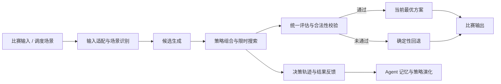

# AutoSolver

面向即时配送场景的自主策略搜索与可解释调度系统。

AutoSolver 是美团 AI Hackathon 2026 命题四项目。系统同时提供比赛求解器和可交互调度工作台：求解器在有限时间内组合候选生成、可行性校验、启发式搜索与安全回退；工作台则把同一订单流下的最近距离贪心基线和 AutoSolver 放在同一时间轴上，展示结果差异、决策依据与经验复用过程。

> 当前仓库保留比赛最终版本。页面指标用于解释和对照调度行为，不替代比赛官方评测结果。

## 核心能力

| 能力 | 说明 |
|---|---|
| 约束感知求解 | 解析任务、骑手、意愿度和组合任务，在合法性约束内生成分配方案。 |
| 多策略竞争 | 综合使用贪心、匹配、稀疏覆盖、列搜索、最小费用流和局部修复等策略。 |
| 限时最优输出 | 在固定时间预算内持续保留当前最优合法解，超时前稳定返回。 |
| 自动评估与回退 | 对候选方案统一评分和校验；异常或质量门未通过时切换到确定性回退方案。 |
| 决策可追溯 | 展示触发原因、候选过滤、策略评分、采纳方案和放弃原因。 |
| 长期记忆 | 记录场景、策略和结果反馈，为后续相似调度轮次提供参考。 |
| 公平双屏对比 | 基线与 AutoSolver 共用订单流、骑手初态和推演时钟，便于逐单核对差异。 |

## 系统架构



项目包含两条相互独立的运行链路：

| 链路 | 入口 | 用途 |
|---|---|---|
| 比赛求解器 | `solver.py` | 接收比赛候选数据并返回合法分配结果。 |
| 调度工作台 | `web_agent_demo/server_v9.py` | 展示全天调度、双屏对比、决策过程和长期记忆。 |

## 快速开始

### 环境要求

- Python 3.10 或更高版本
- 核心求解与本地演示只使用 Python 标准库，无需安装第三方依赖

### 启动调度工作台

```bash
git clone https://github.com/XxJjTt6/AI-Hackahton_meituan.git
cd AI-Hackahton_meituan
python3 web_agent_demo/server_v9.py --host 127.0.0.1 --port 8799
```

浏览器访问 `http://127.0.0.1:8799`。

### 调用比赛求解器

```python
from pathlib import Path

from solver import solve


# 读取符合比赛格式的候选数据。
input_text = Path("data/official_cases/large_seed301.txt").read_text(encoding="utf-8")

# 在时间预算内计算任务与骑手的分配结果。
assignments = solve(input_text)

# 每一项均为“任务组合 + 骑手列表”。
for task_group, courier_ids in assignments:
    print(task_group, courier_ids)
```

## 调度工作台

工作台围绕同一份仿真数据提供五个互相校验的视图：

| 页面 | 主要内容 |
|---|---|
| 双屏对比 | 同步回放最近距离贪心和 AutoSolver 的路线、等待时间、配送成本与超时情况。 |
| 决策过程 | 展示已经发生的调度轮次，以及每轮的触发、过滤、评分、派单和放弃原因。 |
| 长期记忆 | 展示经验召回、结果回写、场景复用和策略置信度变化。 |
| 订单池 | 按推演时钟查看已经下单的订单、风险和两套算法的处理结果。 |
| 骑手运力 | 查看骑手班次、位置、负载、任务链和预计空闲时间。 |

建议依次查看“双屏对比 → 决策过程 → 长期记忆 → 订单池 → 骑手运力”：先观察结果，再追溯原因，最后核对当时可见的订单与运力输入。

## 项目结构

```text
AI-Hackahton_meituan/
├── solver.py                 # 比赛正式求解入口
├── solution.py               # 兼容不同评测导入方式的 API
├── example_solver.py         # 最小兼容入口示例
├── _bench.py                 # 本地性能与代理指标基准
├── autosolver/               # 候选生成、搜索、评估、校验与回退
├── autosolver_agent/         # Agent 编排、Critic、记忆与策略演化
├── web_agent_demo/           # 全天仿真与五页调度工作台
├── data/official_cases/      # 仓库内置的样例数据
├── tests/                    # 单元、契约、仿真和页面测试
├── tools/                    # 追踪、演化演示与交付打包工具
└── docs/                     # 产品、技术和项目结构文档
```

各目录的职责、主要入口和使用方式已分别写入对应目录的 `README.md`。更完整的阅读索引见 [文档中心](docs/README.md)。

## 验证

运行快速验证：

```bash
python3 -m py_compile solver.py web_agent_demo/server_v9.py
python3 -m unittest \
  tests.test_main \
  tests.test_submission \
  tests.test_dispatch_workbench_data \
  tests.test_web_agent_demo_v9
```

运行本地基准：

```bash
python3 _bench.py solver.py 1
```

## 数据与结果边界

- `data/official_cases/` 保存随仓库发布的样例输入和示例输出。
- `web_agent_demo/generated_cases/` 保存用于演示与回归测试的确定性构造场景。
- 两套演示算法使用相同的订单流、骑手初态和推演时钟。
- 工作台中的成本、时间和超时指标来自本地仿真，用于解释系统行为。
- 正式结果和排名以比赛方评测记录为准。

## 文档

- [文档中心](docs/README.md)
- [项目结构](docs/PROJECT_STRUCTURE.md)
- [产品说明](docs/deliverables/产品说明文档.md)
- [技术文档](docs/deliverables/项目文档.md)
- [作品简介](docs/deliverables/作品简介.md)

## License

本项目基于 [MIT License](LICENSE) 开源。
