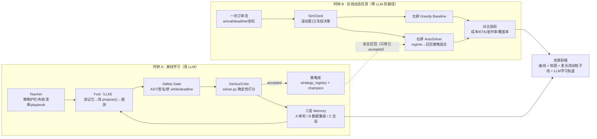

# 会议明确有用点 · 详细执行方案 v3（LLM 大改版）

> 日期：2026-06-25
> 基准项目：`/Users/比赛/美团黑客松决赛/AI-Hackahton_meituan_logg_在这版上面改`
> 参考项目（香港团队"走路不要看手机"组获奖作 MTASA）：`/Users/比赛/美团黑客松决赛/MTASA`
> 上游两版（本 v3 在其基础上合并升级，不改原文件）：
> - `/Users/比赛/美团黑客松决赛/AI-Hackahton_meituan_logg_在这版上面改/docs/会议明确有用点_详细执行方案_v2_20260625.md`（演示/视觉/诚实护栏线）
> - `/Users/比赛/美团黑客松决赛/AI-Hackahton_meituan_logg_在这版上面改/docs/会议明确有用点_LLM重做详细执行方案_v2_20260625.md`（真 LLM 重做线）
> 原则：正式 `solver.py` 热路径零改动；所有新实现一律新建文件，不在原文件上改。

---

## 0. 这版到底改了什么（先看这一段）

前两版各对了一半：一版把"动态仿真 + 双屏对比 + 流动粒子线"做扎实了，但为了诚实把 LLM 完全挡在门外，自主学习降级成了"场景识别记忆召回"；另一版把"真 LLM 闭环"的架构清单列全了，但没有把 LLM 和动态仿真、可视化拧成一条因果主线，也没解决"真 LLM"和"不撒谎"的根本冲突。

**v3 做三件事，把两条线合并成一份能直接执行、又压得住答辩追问的权威方案：**

1. **真的接 LLM，而且照 MTASA 的 `Fool → Genius → Teacher → Memory` 闭环接**（命中会议第 4 点 + 第 2 点）。关键不是"贴个 LLM 标签"，而是让 LLM 在**离线进化轨道**里真正地：读经验 → 改策略代码 → 本地烟测 → 交给确定性 Critic 打分 → 写记忆 → 下一轮更聪明。**这套闭环跑出来的直接副产品，就是我们一直缺的那条真实 `accepted` lineage**（当前 `strategy_registry.json` 全是 `accepted=0`，这是答辩最大的雷，这一版正面把它拆了）。

2. **用"两个时钟"诚实框架，让"真 LLM"和"不撒谎"同时成立**（见 §2）。这是 v3 的核心思想，前两版都没说清。

3. **把 LLM 真正塞进动态仿真的因果里**，不只是旁边放个学习曲线（见 §6 我补充的三条更强想法）：tick 级 LLM 调度解说 Critic、仿真停滞自动触发 Teacher Review 产出新策略并被下一次回放召回、两个时钟同屏对照。再叠上图一红框那条**发光流动粒子线**（真代码移植，§8）。

一句话定位：

> **我们参考 MTASA 的 Genius/Fool/Teacher 四角色，把项目从"规则化 Agent 展示"升级为"真 LLM 离线自主学习 + 在线安全召回"的闭环；LLM 离线生成/修复候选策略、由确定性 Critic 与沙箱筛选、沉淀进三层 memory；动态仿真里系统按时间轴滚动求解，左右双屏 + 底部三线曲线证明 AutoSolver 在高峰/低意愿/骑手稀缺下比 Greedy 更稳，被采纳的派单路径用发光流动粒子线呈现。**

---

## 1. 会议四点要求 → 本方案落地总表

> 来源：`/Users/比赛/美团黑客松决赛/会议-明确有用的点-不带港中文版.md`（#1 动态仿真+对比可视化 / #2 自主策略设计 / #3 自主学习前端展示）+ 带港中文版的 #4（老师给的"接 LLM 思路"，港中文 MTASA 就是照这条做的）。

| 会议点 | 老师原话/红线 | 本方案怎么落地 | 章节 |
|---|---|---|---|
| **#1 动态仿真** | "含时间轴、骑手移动、订单产生，验证不同时间片鲁棒性" | 感知驱动滚动时域引擎 + SimClock + 一天订单分布 + Peak Shock | §6.1–6.3 |
| **#1 指标可视化** | "把打分映射成平均配送 ETA/成本" | `business_metrics_v3.py` 统一出 ETA/成本/准时率/覆盖率（ETA 独立于成本函数） | §6.5 / §7.3 |
| **#1 对比式可视化** | "左基线/右优化，下方曲线实时对比核心指标" | 双屏地图 + 底部三泳道曲线 | §7 |
| **#2 自主策略设计（几个 agent、memory、交互）** | "比讲算法内核还重要，是最吸引人的差异化" | 对外四角色（Genius/Fool/Teacher/Frontend）+ 三层 memory + LLM 自进化闭环 | §4 / §5 |
| **#2 参考港校项目找更新架构** | "他们整体结构和我们差不多，让 AI 搜更新的自主学习架构" | 对标 MTASA 真代码 + ReEvo/EoH/FunSearch 学术线（§5.7 备问） | §5 / §5.7 |
| **#3 前端展现求解结果好不好** | "前端要展现最终求解结果好不好" | 双屏 + 顶部判决卡 + 流动粒子线收束 | §7.1 |
| **#3 前端展现自主学习过程+结果（Hermes 式）** | 红标 30:33 "展现学习的过程和结果"，"用 hermes 那套前端展示" | LLM 学习轨道面板：prompt→tool→patch→smoke→judge→memory→召回 + 学习曲线 | §7.4 |
| **#4 接 LLM 的思路（港中文就是这么做的）** | 老师建议 6：给了一种接 LLM 的方式 | **真接 LLM**：照 MTASA 的 Fool/Genius/Teacher 工具闭环离线进化，产出真实 accepted lineage | §5 |
| 路线视觉（用户指定） | 图一红框"流动感 + 粒子感"的线 | 四层叠加发光流动粒子线（真代码移植） | §8 |

---

## 2. 核心：用"两个时钟"让"真 LLM"和"不撒谎"同时成立

这是 v3 的灵魂，也是答辩不翻车的关键。前两版的矛盾在于：要么真接 LLM 但怕现场联网/怕被问"是不是 LLM 现场乱改 solver"，要么为了稳干脆不接 LLM。**正确答案是把系统拆成两个时钟，分别回答老师的两个问题。**

```text
时钟 A · 学习时钟（离线，赛前/演示前发生，单位=轮 round）
  LLM 在隔离实验轨道里一轮轮地：读记忆 → 改 propose() 策略 → 本地烟测 → Critic 打分 → 写记忆。
  产物：一条真实的策略进化 lineage（v001 失败→v002 修复→v003 accepted，成本下降），落盘在 llm_memory/。
  这是"自主学习的过程"——可录屏、可回放、可审计。现场不依赖网络。

时钟 B · 调度时钟（在线，现场演示，单位=仿真分钟）
  动态仿真推进一天订单流；每个 tick 系统按场景画像，从"时钟 A 学好并通过 Critic 的策略库"里召回策略组合，滚动求解。
  这是"学习的结果"——左右双屏证明召回了好策略的 AutoSolver 比固定 Greedy 更稳。
```

**对外只讲一句话就能挡住所有追问：**

> "学习发生在离线（时钟 A），现场只做安全召回（时钟 B）。这正是生产级调度系统该有的边界——线上系统永远不会让一个 LLM 实时改写正在跑的求解器。我们离线学到的东西，现场用确定性的方式安全地用出来。"

这同时满足：①真的接了 LLM（时钟 A 是真 LLM 真闭环）；②不撒谎（现场热路径零 LLM，正式 `solver.py` 零改动）；③正面对齐老师 2026-06-24 的纠正"进化的是对场景的识别/策略选择，不是现场改求解器"；④顺手把"accepted=0"这个最大的雷拆了（时钟 A 会真的产出 accepted 案例）。

---

## 3. 现有家底（带真行号）+ MTASA 可借鉴点

### 3.1 我们项目现有能力（answer 时按真行号说，别凭空编）

| 能力 | 位置（绝对路径 / 行号） | 复用方式 |
|---|---|---|
| 正式求解器入口 | `/Users/比赛/美团黑客松决赛/AI-Hackahton_meituan_logg_在这版上面改/solver.py:19 solve(input_text)` | 只读复用，做右屏核心求解器与 fallback，**不改**。 |
| 贪心基线 | `solver.py:1661 _fallback_official_greedy(candidates)` | 左屏 baseline。 |
| 统一成本口径 | `solver.py:1647 _solution_expected_cost(result, candidates, all_tasks)` | 成本指标只走这条；**ETA 不走它**（§11 红线）。 |
| 主要求解策略族 | `solver.py`：`_solve_single_task_multidispatch` / `_solve_disjoint_then_multidispatch` / `_solve_pair_potential_matching` / `_solve_sparse_cover` / `_solve_low_global_column_search` / `_solve_scarce_bundle_mcf_enum` 等 | 作为 LLM 策略模板的"参考样例"（让 LLM 模仿这些 `propose` 风格）。 |
| Agent 编排 + 事件流 | `/Users/比赛/美团黑客松决赛/AI-Hackahton_meituan_logg_在这版上面改/autosolver_agent/system.py`（`run_agent(input_text, case_id, budget_s, observer)`） | 右屏 Agent 机制区数据源。 |
| 真实事件类型 | `system.py`：`perception`(:409) / `critic_policy`(:412) / `round_start` / `attempt_start` / `attempt_result` / `best_update` / `adapt` / `evolution_generate` / `evolution_validate` / `evolution_trial` / `evolution_recall` / `evolution_promote` / `evolution_rollback` / `final` | 直接映射成前端时间线，**不要造不存在的事件名**。 |
| 策略生成 + 安全沙箱 + registry + memory | `/Users/比赛/美团黑客松决赛/AI-Hackahton_meituan_logg_在这版上面改/autosolver_agent/evolution.py`：`EvolutionManager`（`generate_strategy`:60 / `safety_check`:94 / `run_generated_strategy`:116 / `trusted_strategies`:160） | **这是接 LLM 的天然落点**：把 `generate_strategy()` 的"写死模板"换成"LLM 生成"，其余沙箱/打分/记忆框架直接复用。 |
| 进化状态落盘 | `/Users/比赛/美团黑客松决赛/AI-Hackahton_meituan_logg_在这版上面改/autosolver_agent/evolution_state/`：`generated_strategies/*.py`、`evolution_memory.jsonl`、`strategy_registry.json` | L1/L2 memory 真实文件；当前全 `accepted=0`（待时钟 A 补真案例）。 |
| 安全门白/黑名单 | `evolution.py:15 ALLOWED_IMPORTS` / `:16 BLOCKED_CALLS` / `:17 BLOCKED_ATTR_ROOTS`；签名校验 `propose(candidates, all_tasks, deadline, helpers)` | 直接复用并增强（加禁 `while True`、强制 deadline 检查）。 |
| 当前网页工作台 | `/Users/比赛/美团黑客松决赛/AI-Hackahton_meituan_logg_在这版上面改/web_agent_demo/server.py`（约 6975 行，内联渲染；路由见 `/api/run`:6917、`/api/stream`:6923 SSE） | 作参考；**新页面另起 `server_v3.py`，不改 `server.py`**。 |
| 坐标合成 / 兜底倍率（要避开的坑） | `web_agent_demo/server.py:82 _stable_point()`（SHA1 哈希坐标）；前端 `bestCost*2.2` 类固定倍率 fallback | 演示双屏**必须用真实 greedy 真值**，禁用固定倍率。 |
| 地图 / 路线 payload | `web_agent_demo/delivery_routes_clone.py`、`web_agent_demo/reasongraph_clone.py` | 复用拿地图/商家/骑手/路线点。 |
| **流动粒子线成品（可移植）** | `/Users/比赛/美团黑客松决赛/AI-Hackahton_meituan_提交版原版/web_agent_demo/static_rg/app.js:765-944`（`addAnim`:765 / `pulseRing`:770 / `smoothPath`:779 / `cometAlong`:798 / hero 四层路线:928-941）。另一副本：`/Users/比赛/美团黑客松决赛/AI-Hackahton_meituan_claude_v19/web_agent_demo/static_rg/app.js` | 直接抽出移植，见 §8。**注意：当前 `在这版上面改` 项目里没有 app.js，必须从姊妹副本移植。** |
| 唯一干净算例 | `/Users/比赛/美团黑客松决赛/AI-Hackahton_meituan_logg_在这版上面改/data/official_cases/large_seed301.txt`（40 任务×80 骑手，33779 候选行） | 现场动态仿真主算例（贪心 2097.658 → 求解 657.104，−68.7%，确定性可复现）。 |

### 3.2 MTASA 真实可借鉴点（带真路径，对标但不照搬）

MTASA = 四角色本地 Python 系统，主循环 `Teacher Signal → Fool Edit → Genius Score → Memory Update → Next Round`。

| MTASA 模块 | 真实位置 | 我们借鉴什么 |
|---|---|---|
| Fool（迭代型 LLM Agent） | `MTASA/fool/fool_loop.py`（`run_fool_loop`）+ `MTASA/fool/harness/runner.py:321 run_round()`（单轮 LLM 工具循环） | 单轮 `run_round` 的工具循环骨架：`<intent>` 强制 → 工具调用 → smoke gate → `<final>` guard。 |
| LLM 客户端（多 provider） | `MTASA/fool/llm_client.py`（OpenAI/Anthropic/DeepSeek/OpenRouter/DashScope，`_resolve_chat_endpoint` / `_apply_effort_to_payload`；从 `~/.zshrc` 读 key） | 移植成 `llm_client_v3.py`，**默认 Anthropic Claude**；带 `FakeModelClient` 离线可测。 |
| 代码编辑工具 | `MTASA/fool/harness/_block_patch.py`（SEARCH/REPLACE 原子块 + 自动 snapshot + 可回滚） | 我们第一阶段先用更简单的"整文件 draft 重写 + 受限 patch"，预留 block_patch 升级位。 |
| Genius（确定性评测器） | `MTASA/genius/genius_judge.py`（validation → subprocess 跑 case → official_like 递归期望打分 → report） | 我们直接复用 `solver.py:1647 _solution_expected_cost` + `summarize_solution`，无需重写打分。 |
| Teacher（策略库 + 周期复盘） | `MTASA/teacher/DATA_STRATEGY_PLAYBOOK.md`（嵌入 system prompt）+ `MTASA/fool/harness/teacher_review.py`（停滞触发复盘） | 写我们自己的 `teacher_playbook_v3.md`（即时配送策略护栏）+ 停滞触发 review。 |
| 多层 memory | `MTASA/fool/memory_store.py`（BM25 检索）+ `MTASA/docs/FOOL_MEMORY.md`、`MTASA/docs/两个 memory 的层次关系.md`；落盘 `out/memory/runs/<dataset_fp>/episodes.jsonl` + `out/memory/MEMORY.md` + `notes/{preferences,lessons,try_error,key_decisions}_*.md` | 三层 memory 的分层叙事与 BM25 召回（§5.3）。 |
| 安全/学习信号 | smoke gate（`runner.py:647`）、final guard（`runner.py:271`）、桶级 outcome（`bucket_classify.py`）、重复检测、停滞衰减 | 全部对标进我们的 `sandbox_v3` + `outcome_reflector`。 |
| 前端 | `MTASA/frontend/`（标准库 http.server + 轮询 + 展示 AI 思考/每轮分数/桶对比） | 借展示形态；我们做得比它更强（双屏 + 流动粒子线 + 动态曲线）。 |

**对外话术（命中老师"参考港校 + 找更新架构"）**："我们的整体结构与香港团队 MTASA 的多角色 + 多层记忆思路一致，并在'即时配送的场景识别记忆'和'动态滚动求解'上做了专门设计；学术上对标 CityU 的 EoH/AEL、ReEvo（反思进化）、DeepMind FunSearch 这条自进化求解器路线。"

---

## 4. 总体架构（四角色 + 三层 memory + 两个时钟）



**四角色 → 落到我们真实模块（老师问"几个 agent"就这么答）：**

| 对外角色 | 内部落点 | 真实出处 |
|---|---|---|
| **Genius**（确定性评测器，绝对真理） | `autosolver_llm_v3/genius_v3.py` | 封装 `solver.py:1647 _solution_expected_cost` + `tools/agent_trace_demo.py:summarize_solution` |
| **Fool**（LLM 迭代主体） | `autosolver_llm_v3/harness_v3.py` + `tools_v3.py` | 新建；对标 `MTASA/fool/harness/runner.py:321` |
| **Teacher**（策略库 + 护栏 + 复盘） | `autosolver_llm_v3/teacher_v3.py` + `teacher_playbook_v3.md` | 新建；对标 `MTASA/teacher/` |
| **Frontend**（控制台 + 可视化） | `web_agent_demo/server_v3.py` + `static/*_v3.js` | 新建；复用现有 payload 函数 |

> 工程实情要诚实讲：这是"**一个统一控制器编排四个逻辑角色**"，不是四个独立进程。重点是职责分离 + 闭环，不虚构多进程。

---

## 5. LLM 自主学习闭环（照 MTASA 落到我们项目）—— 详细

### 5.1 为什么让 LLM 改 `propose()` 而不是改 `solver.py`

`solver.py` 是为 10 秒预算高度压缩的热路径，变量名压缩、局部不变量多，让 LLM 直接改它风险极高且不可控。所以**第一阶段 LLM 只生成/修改一个受限的策略模块**：

```python
def propose(candidates, all_tasks, deadline, helpers):
    # candidates: 解析好的候选行；all_tasks: 全部任务键；deadline: 截止时刻；helpers: 只读工具集
    ...
    return [(task_key, [courier_id, ...]), ...]   # 必须是 list[tuple[str, list[str]]]
```

这个 `propose()` 正好是现有 `EvolutionManager.run_generated_strategy()`（`evolution.py:116`）已经支持的签名 —— **沙箱、打分、registry、memory 全都现成，我们只换"生成层"**。等时钟 A 跑出多条稳定 accepted 策略后，再人工/工具化把最优的合并进一个新版 `solver_llm_v3.py`（可选，不阻塞答辩）。

### 5.2 单轮主循环 `run_round()`（对标 MTASA `runner.py:321`）

```text
run_round(state, model, tools, memory, teacher, max_steps=40):
  messages = [system_prompt(teacher), round_header(state, memory)]
  draft = 从 best_propose / 模板 初始化
  pending_smoke = False
  while step < max_steps:
    raw = model.complete(messages, max_tokens=8000)      # 唯一一次 LLM 调用/步
    intent, kind, payload = parse(raw)                    # kind ∈ {tool, final, retry}
    if kind in (tool, final) and not intent:             # 强制 <intent>：每步先说"做什么/为什么/期望信号"
        push("缺少 <intent>，先补一句再调工具"); continue
    if kind == tool:
        result = tools.run(payload.name, payload.args)    # 见 §5.4 工具表
        push(format(result))
        if payload.name in {draft_strategy, patch_strategy}: pending_smoke = True
        if payload.name == smoke_test_strategy:           pending_smoke = False
        continue
    if kind == final:
        if pending_smoke: push("改完必须先 smoke_test_strategy"); continue   # smoke gate
        if final_guard(payload.plan) == violations: push(feedback); continue  # 一致性 guard
        return draft_propose_code, payload.plan
  raise HarnessFailure   # 超步数失败本轮记 try_error
```

外层 `evolution_runner_v3.py` 把 `run_round` 包成多轮（时钟 A）：

```text
for round in 1..N:
   code, plan = run_round(...)                       # Fool 产出候选 propose()
   if duplicate(code): outcome = duplicate_skipped; continue   # 重复检测，省评测
   verdict = genius_v3.judge(code, case, baseline)   # 确定性打分（§5.5）
   outcome = classify(verdict)                       # improved / neutral / regressed
   memory.write_episode(round, plan, verdict, outcome)   # B 层
   if outcome == improved:
        registry.promote(code); memory.write_note("lesson", ...)   # 写 C 层 + 升 champion
   else:
        memory.write_note("try_error", reason)        # 写 C 层失败经验，下轮降权
   if stagnant(last_3): teacher_review()              # 停滞触发复盘，注入下一轮 header
```

### 5.3 三层 memory（对标 MTASA，落到我们项目）

| 层 | 名称 | 存什么 | 落盘位置（绝对路径前缀同项目根） |
|---|---|---|---|
| **A** | 单轮转写 | 本轮 LLM 对话、工具调用、大输出索引 | `llm_runs/<run_id>/round_NNN/dialog.jsonl` + `tool_results/<uuid>.txt` |
| **B** | 数据集级 | 同一算例/同一 regime 的 episodes、策略索引、桶冠军 | `llm_memory/runs/<dataset_fp>/episodes.jsonl`、`strategy_index.json`、`buckets/<regime>/champion.py`；**桥接现有** `autosolver_agent/evolution_state/evolution_memory.jsonl` + `strategy_registry.json` |
| **C** | 全局长期 | 跨算例复用的 lesson / try_error / key_decision，BM25 可检索 | `llm_memory/MEMORY.md` + `llm_memory/notes/{lesson,try_error,key_decision}_*.md` |

一句话讲法：**"A 是这一轮 LLM 具体说了/做了什么；B 是这个场景历史上试过哪些策略、哪条最优；C 是跨场景沉淀的'什么场景该上什么策略、什么坑别再踩'。"**

检索：移植 MTASA 的 BM25（`MTASA/fool/memory_store.py`）做轻量纯 Python 版（关键词匹配 + regime 标签重叠 + 最近收益加权），**不引向量库**（更透明、好审计、好讲）。

### 5.4 Fool 的工具集（LLM 只能在这些工具里活动 = 安全边界）

| 工具 | 行为 | 落点 |
|---|---|---|
| `profile_case` | 返回任务数/骑手数/候选行数/bundle/平均意愿/regime | 复用 `tools/agent_trace_demo.py:infer_regime` |
| `read_teacher_checklist` | 返回策略护栏 + 当前禁止做的事 | `teacher_v3.py` |
| `memory_search` / `memory_get` | 从 B/C 层 BM25 检索 + 读指定行 | `memory_v3.py` |
| `list_strategy_templates` | 列 greedy / low_w / scarce / bundle 等模板 | 取自 `solver.py` 策略族签名 |
| `read_current_best_strategy` | 读当前 champion 的 `propose()` 全文 | `registry` |
| `draft_strategy` | 写入 sandbox 草稿 `propose()` | `sandbox_v3.py` |
| `patch_strategy` | 对草稿做受限替换（SEARCH/REPLACE 雏形） | `sandbox_v3.py` |
| `smoke_test_strategy` | 小样本合法性 + 耗时 + 输出格式预检 | 复用 `EvolutionManager.run_generated_strategy` 的轻量模式 |

**安全门（`sandbox_v3.py`，复用并增强 `evolution.py:94 safety_check`）**：

- 白名单 import（`collections/heapq/itertools/math/random/time`），禁 `os/sys/socket/subprocess/pathlib`；
- 禁 `eval/exec/compile/open/__import__/globals/locals`；
- **新增**：禁 `while True` 无界循环、强制函数体出现 `deadline` 检查、强制签名 `propose(candidates, all_tasks, deadline, helpers)`、强制返回 `list[tuple[str, list[str]]]`。

### 5.5 Genius/Critic（确定性，不让 LLM 自评）

输入候选 `propose()` + 算例 + baseline + 预算；输出（前端可展示、memory 可记录）：

```json
{ "valid": true, "accepted": true, "reason": "improved expected cost",
  "baseline_cost": 2097.66, "candidate_cost": 657.10, "coverage": "40/40",
  "elapsed_ms": 83.2, "regime": "large" }
```

判定：合法 + 覆盖不降 + 不超时 + `candidate_cost ≤ baseline − ε` 才 accepted。打分只走 `solver.py:1647 _solution_expected_cost`，**不另造分数**。

### 5.6 LLM 客户端（多 provider，默认 Claude，离线可测）

移植 `MTASA/fool/llm_client.py` → `llm_client_v3.py`：

- 默认 **Anthropic Claude**（推荐 `claude-opus-4-8` 做策略生成主力，可配 `claude-sonnet-4-6` 省成本）；兼容 OpenAI/DeepSeek/OpenRouter/DashScope。key 从环境变量读（`ANTHROPIC_API_KEY` 等），不写进仓库。
- 必带 `FakeModelClient`：用预置脚本回放一轮"生成→失败→修复→accepted"，**无 key、断网也能跑单测和演示**。
- 现场演示默认走 `FakeModelClient` 回放真实跑过的 `llm_runs/`（时钟 A 的录像），不赌现场网络。

### 5.7 这套闭环第一次产出真实 `accepted` lineage（拆掉最大的雷）

赛前用真 Claude 把时钟 A 跑若干轮（`evolution_runner_v3.py --provider anthropic --rounds 8`），目标：在 `large_seed301`（或某个 regime）上拿到**至少一条** `v00x 失败(超时/劣化) → v00y 修复 → v00z accepted（成本下降）` 的真实链条，落进 `llm_memory/` + `strategy_registry.json`。

- 这条 lineage 就是答辩"学习的过程 + 结果"的硬证据，**直接终结"accepted=0 / 假自进化"的质疑**。
- 即便真 LLM 时间不够，`FakeModelClient` 也能产出结构完整、字段真实的可回放 lineage（要诚实标注"该条为离线回放/演示样例"，区别于真模型跑出的）。

### 5.7' 学术对标（仅备问，不主讲）

Reflexion（2303.11366，反思+情节记忆）、Voyager（2305.16291，技能库+自验证）、ADAS（2408.08435，代码层搜索 agentic system）、EoH/AEL（CityU, Fei Liu & Qingfu Zhang）、ReEvo（反思进化，最贴合）、FunSearch（DeepMind）。

---

## 6. 动态求解：A 必做 / B+ 推荐 / 我补充的更强想法

### 6.1 先把"动态求解"讲对（答辩口径）

不要说成"线条动起来"。本项目动态求解 = **滚动时域控制（receding/rolling horizon）**：

> 仿真时钟推进中，订单陆续到达、骑手位置/意愿/路况不断变化；每个时间片对"已出现且未锁定"的订单构造滚动窗口重新求解；已派出不可撤销的决策冻结，新订单与未完成订单进入下一轮局部优化。

它比"静态算例跑一次再放动画"强在：①订单陆续到达非一次性全知；②高峰压力变化驱动策略切换；③随时有可行解又能用剩余时间继续改进；④同一动态输入下 AutoSolver 比固定 Greedy 更稳。正好回应老师"纵向扩展：静态仿真 → 动态跨时间片求解"。

### 6.2 A 方案（第一版必做，风险最低）

```text
输入：large_seed301（或 generated_cases 样例候选行）
预处理：给订单合成 arrival_minute / deadline_minute / 商家·骑手坐标（仿真层，打"演示"角标）
时钟：每 tick = 若干仿真分钟，推进 0–1440（一天）
每个 tick：
  1. 注入当前 tick 到达的新订单
  2. 更新骑手状态：available / assigned / moving / finished
  3. 左屏跑 Greedy（_fallback_official_greedy）对 active window
  4. 右屏跑 AutoSolver（run_agent / solver.solve）对同一 active window
  5. 冻结本 tick 已派出订单
  6. 记录 成本 / ETA / 准时率 / 覆盖率 / 耗时 / 当前策略
输出：DynamicSolveStep 序列，前端本地播放（先不做 SSE，更稳）
```

### 6.3 B+ 方案（推荐升级）= 感知驱动滚动时域 + 记忆冷暖三泳道

**支柱一：事件驱动滚动时域**（讲"机制 > 算法"+"纵向扩展"）

```text
触发重算：新订单批量到达 / 骑手完成上一单 / 区域订单密度突升 / regime 切换 / 覆盖率·准时率跌破阈值
滚动窗口：只优化未来 20–30 分钟可决策订单；已接单/已出发路线冻结；只对受影响区域局部修复，避免全量重算
策略路由（regime → 策略组合）：
  平峰        → greedy + single_multidispatch
  午高峰      → disjoint_gain + pair_matching + production_solver
  低意愿/雨天 → low_global_column + sparse_cover
  骑手稀缺    → scarce_k2_column + scarce_bundle_mcf
```

**支柱二：记忆冷暖三泳道**（把"自主学习的过程和结果"画进同一块屏，且诚实）

底部曲线放**三条线**（地图只画两张，避免老师批"信息密度低看不清"）：

| 泳道 | 含义 | 学不学 |
|---|---|---|
| Greedy 基线（橙） | 固定贪心，永不学 | 否 |
| AutoSolver 冷启动（蓝） | 有机制但 memory 清空，每 tick 都"第一次见这场景" | 机制有、记忆无 |
| AutoSolver 暖启动（青绿） | 同机制 + 时钟 A 学到并通过 Critic 的策略库，相似场景直接召回 | 机制有、记忆有 |

随一天推进：暖启动的**场景识别命中率/置信度**往上爬（副轴细线），业务指标相对冷启动**逐步拉开**——这条"冷暖差"就是老师红标 30:33 要的"学习过程 + 结果"，且是**同源对比**（同订单流、同时钟、同指标，唯一变量=有没有记忆），抗"是不是拿不同算例比"的质疑。

> 降级路径：先做两泳道（Greedy / AutoSolver）跑通双屏，再叠第三条暖启动。第三条来不及也已覆盖会议主诉求。

### 6.4 ⭐ 我补充的三条更强想法（v3 新增，把 LLM 真正塞进动态因果）

前两版的 LLM 和动态仿真是"两张皮"（LLM 在离线轨道、仿真在另一块屏）。我建议加三条，让它们形成**因果闭环**，答辩冲击力强一截：

**① tick 级 LLM 调度解说 Critic（真 LLM，但绝对安全）**
每个 tick（或每次 regime 切换），调一次轻量 LLM，输入"当前场景画像 + 选了哪套策略 + 指标变化"，产出一句**自然语言解说 + 风险提示**，例如："午高峰订单密度↑、骑手意愿↓ → 切到 pair_matching + production_solver 求组合收益；预测准时率有 6% 下行风险，已提高多派阈值。" 
- 安全：LLM **只解说/提示，不决策**；决策永远由确定性求解器做。
- 价值：直接让"自主学习前端"（点 3）有真 LLM 文本在跑，而不是假的"AI 正在思考"动画；现场可用 `FakeModelClient` 回放预生成解说，断网不崩。
- 落点：`autosolver_llm_v3/dispatch_commentator_v3.py`，前端右屏事件流逐条显示。

**② 仿真停滞 → 触发离线 Teacher Review → 产出新策略 → 下次回放被召回（因果闭环）**
当动态曲线显示某 regime 下 AutoSolver 持续不佳（如 Peak Shock 后准时率掉、连续 N tick 无改善），**自动把该 regime 的失败画像喂给时钟 A 的 Teacher/Fool**，离线生成一条针对该 regime 的新候选策略，过 Critic accepted 后写入策略库；**下一次回放同一订单流时，暖启动泳道在那个时间段明显追上**。
- 这把"动态仿真"和"LLM 学习"接成一条因果链：**仿真暴露弱点 → LLM 学新策略 → 仿真验证变好**。这正是老师想看的"学习的过程和结果"的最强叙事。
- 诚实：这是离线发生的（时钟 A），现场演示对比"打补丁前回放 vs 打补丁后回放"两段录像/两次回放。

**③ 两个时钟同屏对照**
前端右上角放一个小"学习时钟"（round 1→N 的进化曲线缩略图，时钟 A），主区是"调度时钟"（一天仿真，时钟 B）。点学习时钟的某一轮，可联动高亮"那一轮学到的策略在调度时钟的哪个时间段被召回、带来多少改善"。一眼讲清"离线学、在线用"。

### 6.5 Peak Shock Drill（高峰冲击演练，保留）

午高峰注入一次突发冲击（12:10 局部雨天/活动拥堵 → 意愿↓、ETA↑）。感知层切到低意愿/稀缺策略，底部曲线显示"扰动—恢复"。这个画面比平滑曲线更能说明动态求解价值，也正好是 §6.4② 的触发场景。

### 6.6 业务指标（被追问不翻车）

| 指标 | 来源 | 上屏 | 备注 |
|---|---|---|---|
| `expected_cost` | `solver.py:1647 _solution_expected_cost` | 是 | 叫"每单期望成本"，不冒充官方线上分。 |
| `avg_eta_min` | 路线几何距离 / 速度估算 | 是 | **独立于成本函数**（§11）。 |
| `on_time_rate` | `eta ≤ deadline` | 是 | deadline 为仿真合成，需角标。 |
| `coverage_rate` | 已覆盖 / 活跃订单 | 是 | 最易懂。 |
| `regime_hit_rate` | 暖启动场景识别命中 / 总判定 | 是（仅暖启动） | "自主学习"的量化曲线。 |
| `accept_risk` | willingness 聚合 `1−∏(1−wᵢ)` | 是 | 子模，不是 Σp。 |
| `solve_latency_ms` | 每 tick 实际耗时 | 是 | 证明动态可实时。 |

---

## 7. 对比式可视化 + 前端（双屏 + 曲线 + LLM 学习轨道，Hermes 式）

### 7.1 页面布局

```text
┌──────────────────────────────────────────────────────────────────────────────┐
│ 顶部判决卡：AutoSolver vs Greedy   每单成本 / 平均ETA / 准时率 / 覆盖率 / 耗时   │
│ 右上角小窗：学习时钟（round 进化曲线缩略图，时钟 A）                            │
├──────────────────────────────┬───────────────────────────────────────────────┤
│ 左屏：Greedy Baseline         │ 右屏：AutoSolver（感知驱动滚动时域）           │
│ - 同步时间轴                  │ - 同步时间轴                                  │
│ - 弱发光静态路线（①②层）     │ - 发光流动粒子线（红框那种，§8 四层全开）      │
│ - 当前派单结果                │ - 当前派单结果 + best-so-far 标识              │
├──────────────────────────────┴───────────────────────────────────────────────┤
│ 底部曲线：订单到达量 / 成本 / ETA / 准时率 / 覆盖率                            │
│   三泳道：Greedy(橙) · AutoSolver冷(蓝) · AutoSolver暖(青绿) + 命中率(副轴细线) │
├──────────────────────────────────────────────────────────────────────────────┤
│ 侧栏 A · Agent 机制区：感知 → 策略 → 执行/评估 → 记忆/进化（真实事件名）       │
│ 侧栏 B · LLM 学习轨道：prompt 摘要 → tool → patch → smoke → judge → memory→召回 │
│ tick 级 LLM 调度解说（§6.4①）逐条滚动                                          │
└──────────────────────────────────────────────────────────────────────────────┘
```

> 老师明确否决"把复杂策略图画到地图上（人看不清）"。所以**推理/策略对比放侧栏与底部，不放地图**；地图只保留"双屏派单 + 流动粒子线"。

### 7.2 现场 60 秒讲法

```text
这一页不是静态地图，是动态调度仿真（时钟 B）。
一天订单按早/午/晚高峰注入，每个时间片同时跑左侧贪心和右侧 AutoSolver。
底部三条线：橙=贪心，蓝=没记忆的 AutoSolver，青绿=带记忆的 AutoSolver。
随这一天推进，青绿越来越好——因为它对场景的识别越来越准、召回的策略越来越对。
这些"记忆"是离线学来的（右上角学习时钟，时钟 A）：LLM 一轮轮改策略、本地打分、写经验，
最终跑出一条真实的"失败→修复→被接受、成本下降"的进化链。
注意：现场不联网、不改正式 solver；学习在离线发生，现场只做安全召回。
右边这条发光流动的粒子线，就是当前被采纳的最优派单路径。
```

### 7.3 API（新版 `server_v3.py`，不改 `server.py`）

| API | 作用 |
|---|---|
| `/api/v3/dynamic/scenarios` | 可选动态场景列表 |
| `/api/v3/dynamic/run?case=large_seed301` | 一次性返回完整 DynamicSolveStep 序列（前端本地播放） |
| `/api/v3/dynamic/stream` | 可选 SSE 逐 tick 播放 |
| `/api/v3/llm/runs` | 返回时钟 A 的进化记录（lineage） |
| `/api/v3/llm/stream` | SSE 回放 LLM 学习轨道（默认放 FakeModelClient 录像） |
| `/api/v3/memory/search?q=...` | 点 memory chip 时展示相关经验 |

### 7.4 "自主学习"展示（Hermes 式：展证据，不展空动画）

| 展示项 | 数据来源 |
|---|---|
| 本轮假设 | LLM final plan / `<intent>` |
| 调用工具序列 | harness transcript（A 层 memory） |
| 策略代码 diff | draft/patch 摘要 |
| 安全门结果 | AST/import/签名检查 |
| smoke 结果 | 小样本合法性 + 耗时 |
| Critic 结果 | expected_cost / coverage / ETA / 超时 |
| memory 写入 | episode / try_error / key_decision |
| 下一轮召回 | BM25/相似度命中的历史经验 |
| best-so-far 阶梯线（**学习结果**） | 每次 accepted 后成本下降的阶梯 |
| 场景识别命中率曲线（**学习过程**） | 暖启动 `regime_hit_rate` |

**页面拆两块（老师建议）**：一块=评估/最终结果（双屏 + 判决卡 + 流动粒子线），一块=策略进化过程（LLM 学习轨道 + 命中率曲线 + 接受率）。同屏分区或切 tab。

---

## 8. 流动粒子线（图一红框那条）—— 四层叠加配方 + 真代码移植

### 8.1 红框效果真相 = 四层 SVG 叠加（核对源 `提交版原版/web_agent_demo/static_rg/app.js:928-941`）

| 层 | 作用 | 关键参数 | 出处行 |
|---|---|---|---|
| ① 发光底 | 青色光晕底 | `stroke rgba(28,244,210,.2)`，width 7.5，`filter url(#glow)` | :929-931 |
| ② 青主线 | 主路径 + 箭头 | `stroke #1cf4d2`，width 3.4，`marker-end url(#arrow)`，`filter url(#glow)` | :932-934 |
| ③ 流动能量虚线（**流动感**） | 短虚线 + dashoffset 动画 | `dasharray "0.1 10"`，`animate stroke-dashoffset 0→-10.1`，dur 0.8s linear | :935-940 |
| ④ 彗星粒子（**粒子感**） | `cometAlong()` 亮头 + 2 段渐隐拖尾，沿同一平滑路径 `animateMotion`，错开 begin | trail `[[3.4,1,0],[2.4,.55,.05],[1.6,.32,.1]]`，亮头挂 `url(#pinGlow)` | :941 / :798 |

口诀：**流动感 = ③ 的 `stroke-dashoffset` 动画；粒子感 = ④ 的彗星拖尾。两者缺一不可。**

### 8.2 移植落点（新建 `flow_route_v3.js`）

把 `提交版原版/.../static_rg/app.js` 的 `smoothPath`(:779) / `cometAlong`(:798) / `addAnim`(:765) + hero 四层路线(:928-941) 抽出，合并成对外唯一接口 `renderFlowRoute(layer, points, opts)`：

```javascript
// flow_route_v3.js —— 源自 提交版原版/web_agent_demo/static_rg/app.js:765-941
const SVGNS = "http://www.w3.org/2000/svg";
const REDUCE_MOTION = window.matchMedia("(prefers-reduced-motion: reduce)").matches;
function svgEl(t,a){const n=document.createElementNS(SVGNS,t);for(const k in a)n.setAttribute(k,a[k]);return n;}
function addAnim(node,t,a){ if(!REDUCE_MOTION) node.appendChild(svgEl(t,a)); return node; }
function smoothPath(points){ /* Catmull-Rom → 贝塞尔，照搬源 :779-797 */ }
function cometAlong(layer,points,dur,group,phase=0){ /* 亮头+2段渐隐拖尾，照搬源 :798-?? */ }
function renderFlowRoute(layer, points, opts={}){
  const cyan=opts.color||"#1cf4d2", dur=opts.durationMs?(opts.durationMs/1000)+"s":"2.7s", d=smoothPath(points);
  layer.appendChild(svgEl("path",{d,fill:"none",stroke:"rgba(28,244,210,.2)","stroke-width":7.5,filter:"url(#glow)","vector-effect":"non-scaling-stroke"})); // ①
  layer.appendChild(svgEl("path",{d,fill:"none",stroke:cyan,"stroke-width":3.4,"marker-end":"url(#arrow)",filter:"url(#glow)","vector-effect":"non-scaling-stroke"})); // ②
  const flow=svgEl("path",{d,fill:"none",stroke:"rgba(224,255,250,.9)","stroke-width":1.8,"stroke-dasharray":"0.1 10","vector-effect":"non-scaling-stroke"});
  addAnim(flow,"animate",{attributeName:"stroke-dashoffset",values:"0;-10.1",dur:"0.8s",repeatCount:"indefinite",calcMode:"linear"}); layer.appendChild(flow); // ③
  if(opts.active!==false) cometAlong(layer,points,dur,opts.id||"route",opts.phase||0); // ④
}
```

需注入一次的 `<defs>`（`glow` / `pinGlow` / `arrow`，源 :854-865）：

```html
<defs>
  <filter id="glow" x="-60%" y="-60%" width="220%" height="220%"><feGaussianBlur stdDeviation="4" result="b"/><feMerge><feMergeNode in="b"/><feMergeNode in="SourceGraphic"/></feMerge></filter>
  <filter id="pinGlow" x="-80%" y="-80%" width="260%" height="260%"><feGaussianBlur stdDeviation="2.4" result="b"/><feMerge><feMergeNode in="b"/><feMergeNode in="SourceGraphic"/></feMerge></filter>
  <marker id="arrow" viewBox="0 0 10 10" refX="7" refY="5" markerWidth="6" markerHeight="6" orient="auto-start-reverse"><path d="M0,1 L8,5 L0,9 Z" fill="#1cf4d2"/></marker>
</defs>
```

### 8.3 性能与降级（直接抄进实现）

1. 只给**右屏 AutoSolver 当前采纳路线**开 ③④ 层；左屏 baseline 只用 ①②（弱发光静态），形成对比。
2. 多路线同时展示时，只给 selected assignment 开彗星，其余只画 ①②。
3. `prefers-reduced-motion` 为真自动关粒子（上面代码已内置），评委机器卡顿也不崩。
4. SVG `fill`/`stroke` 不支持 CSS `var()`，必须写具体色值（源仓库踩过的坑）。
5. 路线点 `route.points` 来自 `web_agent_demo/delivery_routes_clone.py: autosolver_map_payload()`（与现有同源）。

---

## 9. 新建文件清单（全绝对路径，全部新建，不改原文件）

> 目录策略：**就在 `在这版上面改` 项目里新建文件/子包**（满足"在这版上面改"），不复制整仓。正式 `solver.py`/`server.py` 零改动。

### 9.1 LLM 自主学习轨道（时钟 A）
| 文件 | 作用 |
|---|---|
| `/Users/比赛/美团黑客松决赛/AI-Hackahton_meituan_logg_在这版上面改/autosolver_llm_v3/__init__.py` | 包入口 |
| `/Users/比赛/美团黑客松决赛/AI-Hackahton_meituan_logg_在这版上面改/autosolver_llm_v3/llm_client_v3.py` | 多 provider 客户端（默认 Claude）+ `FakeModelClient` |
| `/Users/比赛/美团黑客松决赛/AI-Hackahton_meituan_logg_在这版上面改/autosolver_llm_v3/harness_v3.py` | 单轮 `run_round` 工具循环（intent/smoke gate/final guard） |
| `/Users/比赛/美团黑客松决赛/AI-Hackahton_meituan_logg_在这版上面改/autosolver_llm_v3/tools_v3.py` | profile_case / memory_search / draft_strategy / smoke_test_strategy 等 |
| `/Users/比赛/美团黑客松决赛/AI-Hackahton_meituan_logg_在这版上面改/autosolver_llm_v3/sandbox_v3.py` | 安全门（复用增强 `evolution.py:94`）+ 超时 + 格式校验 |
| `/Users/比赛/美团黑客松决赛/AI-Hackahton_meituan_logg_在这版上面改/autosolver_llm_v3/genius_v3.py` | 确定性 Critic（封装 `_solution_expected_cost` + summarize） |
| `/Users/比赛/美团黑客松决赛/AI-Hackahton_meituan_logg_在这版上面改/autosolver_llm_v3/teacher_v3.py` | 策略护栏 + 失败清单 + 停滞复盘 |
| `/Users/比赛/美团黑客松决赛/AI-Hackahton_meituan_logg_在这版上面改/autosolver_llm_v3/teacher_playbook_v3.md` | 即时配送策略 playbook（嵌 system prompt） |
| `/Users/比赛/美团黑客松决赛/AI-Hackahton_meituan_logg_在这版上面改/autosolver_llm_v3/memory_v3.py` | 三层 memory + BM25 检索 |
| `/Users/比赛/美团黑客松决赛/AI-Hackahton_meituan_logg_在这版上面改/autosolver_llm_v3/evolution_runner_v3.py` | 离线多轮运行入口（产 lineage + 学习曲线） |
| `/Users/比赛/美团黑客松决赛/AI-Hackahton_meituan_logg_在这版上面改/autosolver_llm_v3/dispatch_commentator_v3.py` | tick 级 LLM 调度解说 Critic（§6.4①，只解说不决策） |

### 9.2 动态仿真（时钟 B）
| 文件 | 作用 |
|---|---|
| `/Users/比赛/美团黑客松决赛/AI-Hackahton_meituan_logg_在这版上面改/autosolver_dynamic_v3/order_stream_v3.py` | 一天订单到达分布 + arrival/deadline 合成 |
| `/Users/比赛/美团黑客松决赛/AI-Hackahton_meituan_logg_在这版上面改/autosolver_dynamic_v3/sim_state_v3.py` | 订单/骑手/路线/冻结决策数据结构 |
| `/Users/比赛/美团黑客松决赛/AI-Hackahton_meituan_logg_在这版上面改/autosolver_dynamic_v3/rolling_solver_v3.py` | 每 tick 跑三泳道（Greedy/冷/暖），输出同源快照 |
| `/Users/比赛/美团黑客松决赛/AI-Hackahton_meituan_logg_在这版上面改/autosolver_dynamic_v3/scene_memory_v3.py` | 场景识别记忆（regime→策略组合召回 + 命中率） |
| `/Users/比赛/美团黑客松决赛/AI-Hackahton_meituan_logg_在这版上面改/autosolver_dynamic_v3/business_metrics_v3.py` | 成本/ETA/准时率/覆盖率/风险/耗时（ETA 独立于成本） |
| `/Users/比赛/美团黑客松决赛/AI-Hackahton_meituan_logg_在这版上面改/autosolver_dynamic_v3/scenario_builder_v3.py` | 早/午/晚高峰、雨天低意愿、骑手稀缺 + Peak Shock |

### 9.3 前端新版
| 文件 | 作用 |
|---|---|
| `/Users/比赛/美团黑客松决赛/AI-Hackahton_meituan_logg_在这版上面改/web_agent_demo/server_v3.py` | 新版 HTTP/SSE 入口，复用现有 payload，不改 `server.py` |
| `/Users/比赛/美团黑客松决赛/AI-Hackahton_meituan_logg_在这版上面改/web_agent_demo/static/dashboard_v3.js` | 双屏 + SimClock + 三线曲线 + 学习时钟小窗 |
| `/Users/比赛/美团黑客松决赛/AI-Hackahton_meituan_logg_在这版上面改/web_agent_demo/static/flow_route_v3.js` | 发光流动粒子线（§8） |
| `/Users/比赛/美团黑客松决赛/AI-Hackahton_meituan_logg_在这版上面改/web_agent_demo/static/flow_route_v3.css` | glow/comet/虚线流动/降级样式 |
| `/Users/比赛/美团黑客松决赛/AI-Hackahton_meituan_logg_在这版上面改/web_agent_demo/static/llm_trace_v3.js` | LLM 学习轨道 + 调度解说渲染 |
| `/Users/比赛/美团黑客松决赛/AI-Hackahton_meituan_logg_在这版上面改/web_agent_demo/static/charts_v3.js` | 轻量 SVG 曲线（无第三方依赖） |

### 9.4 测试与文档
| 文件 | 作用 |
|---|---|
| `tests/test_llm_client_v3.py` | FakeModelClient + 错误处理 |
| `tests/test_llm_harness_v3.py` | 工具循环 / final plan / 必须 smoke 后才能 final |
| `tests/test_sandbox_v3.py` | 禁 import/eval/exec/while/非法签名 |
| `tests/test_memory_v3.py` | 三层写入 + BM25 检索 + 去重 |
| `tests/test_genius_v3.py` | 接受/拒绝由确定性 evaluator 决定 |
| `tests/test_dynamic_sim_v3.py` | tick / 订单注入 / 冻结决策 |
| `tests/test_dynamic_compare_v3.py` | 三泳道同源 + 字段齐 + 暖≥冷 |
| `tests/test_scene_memory_v3.py` | 冷启动命中率≈0、暖启动随回放上升 |
| `tests/test_flow_route_v3.py` | HTML/JS 中存在 animateMotion + glow + comet |
| `docs/demo_runbook_v3.md` | 演示脚本 + 点击顺序 + 断网兜底 + Q&A |
| `docs/llm_agent_architecture_v3.md` | 四角色 + 三层 memory + 两个时钟说明 |

（以上相对路径均以 `/Users/比赛/美团黑客松决赛/AI-Hackahton_meituan_logg_在这版上面改/` 为根。）

---

## 10. 分阶段执行计划（含验收命令）

### Phase 0 · 新版入口 + 基线验证（保护原项目）
1. 新建 `web_agent_demo/server_v3.py`（先只返回静态页 + 健康检查）。
2. 跑现有回归确认基线没坏：
```bash
cd /Users/比赛/美团黑客松决赛/AI-Hackahton_meituan_logg_在这版上面改
python3 -m py_compile solver.py autosolver/*.py autosolver_agent/*.py web_agent_demo/server.py
python3 -m unittest tests.test_agent_evolution tests.test_web_agent_demo
python3 _bench.py solver.py 1   # 确认 706.197 口径基线没动
```
验收：原文件零改动；`python3 -m py_compile web_agent_demo/server_v3.py` 通过。

### Phase 1 · LLM 客户端 + 工具循环（时钟 A 骨架）
- `llm_client_v3.py`（移植 MTASA，默认 Claude）+ `FakeModelClient`；`harness_v3.py` 的 `run_round`。
- 验收：`python3 -m unittest tests.test_llm_client_v3 tests.test_llm_harness_v3`；无 key 也能跑。

### Phase 2 · 策略草稿工具 + 安全门
- `tools_v3.py` + `sandbox_v3.py`（复用增强 `evolution.py:94`）。
- 验收：`import os` / `while True` / 非法返回被拒；合法简单 greedy `propose` 过 smoke。`python3 -m unittest tests.test_sandbox_v3`。

### Phase 3 · 三层 memory
- `memory_v3.py` + 落盘结构（§5.3）；桥接现有 `evolution_state/`。
- 验收：跑 3 轮见 3 条 episode；失败轮写 try_error；下轮 `memory_search` 可检索。`python3 -m unittest tests.test_memory_v3`。

### Phase 4 · Genius/Critic + 跑出真实 lineage
- `genius_v3.py`；`evolution_runner_v3.py --fake-model --rounds 3` 先跑通；再 `--provider anthropic --rounds 8` 跑真 Claude，争取 ≥1 条 accepted lineage。
- 验收：`python3 -m unittest tests.test_genius_v3`；`llm_memory/` 出现 episodes + （目标）一条 accepted；`strategy_registry.json` 不再全 0。

### Phase 5 · 动态仿真（时钟 B）
- `order_stream_v3 / sim_state_v3 / rolling_solver_v3 / scene_memory_v3 / business_metrics_v3 / scenario_builder_v3`。
- 验收：高峰密度 > 平峰；冻结订单不被改派；同 tick 左右同源；AutoSolver 异常回退 `solver.solve` 不中断。`python3 -m unittest tests.test_dynamic_sim_v3 tests.test_dynamic_compare_v3 tests.test_scene_memory_v3`。

### Phase 6 · 双屏前端 + 三线曲线 + 学习轨道
- `server_v3.py` 加 §7.3 API（先 `/dynamic/run` 一次性返回，前端本地播放，**先不做 SSE**）。
- `dashboard_v3.js`（双屏同步 + 三线曲线 + 学习时钟小窗）+ `llm_trace_v3.js`（学习轨道 + 调度解说）+ `charts_v3.js`。
- 验收：选 `large_seed301` → 开始 → 左右同步 → 曲线/KPI 同步 → 午高峰有标注 → LLM 学习轨道 ≥3 轮（生成/失败/修复/接受）。

### Phase 7 · 流动粒子线 + tick 级调度解说
- `flow_route_v3.js`（§8）+ `<defs>` 注入；右屏 selected 用 `renderFlowRoute`，左屏只 ①②。
- `dispatch_commentator_v3.py`（现场放 FakeModelClient 回放）。
- 验收：右屏发光青线 + 流动虚线 + 彗星拖尾；>10 条路线不卡；`prefers-reduced-motion` 自动降级；解说与 tick 对齐。`python3 -m unittest tests.test_flow_route_v3`。

### Phase 8 · 录屏 + 答辩材料 + 兜底
- `docs/demo_runbook_v3.md`（3 分钟路径 + 8 个 Q&A + 预生成 trace/lineage JSON 断网可放）。
- 录屏重点：①双屏动态对比，评委立刻看到右屏更稳；②LLM 学习轨道，证明不是固定调参；③memory 召回 + 发光路径，形成"会学习且落到派单结果"的闭环。

### 验证命令汇总
```bash
cd /Users/比赛/美团黑客松决赛/AI-Hackahton_meituan_logg_在这版上面改
python3 -m py_compile \
  autosolver_llm_v3/*.py autosolver_dynamic_v3/*.py web_agent_demo/server_v3.py
python3 -m unittest discover -s tests -p "test_*_v3.py"
python3 autosolver_llm_v3/evolution_runner_v3.py --fake-model --rounds 3
python3 web_agent_demo/server_v3.py --host 127.0.0.1 --port 8766
```

---

## 11. 诚实护栏（红线，照着守）

1. **两个时钟**：学习在离线（时钟 A，真 LLM）；现场调度（时钟 B）**热路径零 LLM**，正式 `solver.py` 零改动。绝不说"现场让 LLM 实时改 solver 并保证变好"。
2. LLM 产物只允许是 sandbox 里的 `propose()`；**不允许写正式 solver、不联网、不文件读写、不 subprocess、不 eval/exec**。
3. `657.104` 是**本地口径**（贪心 2097.658→657.104，−68.7%，确定性），**不冒充官方 706.197 / 654.2935**。
4. 成本与 ETA 走**两条独立路径**：成本走 `solver.py:1647`，ETA 来自路径几何，**不调成本函数**（防"第二目标自拆"）。
5. `deadline`/坐标/ETA 是**仿真合成层**，一律打"演示"角标。
6. accepted lineage 必须区分"真 Claude 跑出"与"FakeModelClient 回放/演示样例"，**不把回放包装成真模型成果**。
7. Agent 是"四个**角色**由统一控制器编排"，**不虚构多进程**。
8. tick 级 LLM 调度解说**只解说不决策**，决策永远由确定性求解器做。

---

## 12. 风险与兜底

| 风险 | 兜底 |
|---|---|
| 真 LLM API 不稳/无 key | 现场走 `FakeModelClient` 回放预跑好的 `llm_runs/`；单测不依赖 key。 |
| LLM 策略质量不稳 | Runtime 只召回 Critic accepted 策略，永远保留 `solver.py` fallback。 |
| 跑不出真 accepted lineage | 退而求其次：用 FakeModelClient 产结构完整 lineage，诚实标注"演示回放"；同时把"安全门拒绝劣化策略"本身讲成质量门价值。 |
| 现场动态求解耗时不稳 | 预生成 trace JSON，前端播放，标"演示回放"。 |
| ETA/deadline 被质疑 | 明说合成、用于鲁棒性展示，不冒充官方指标。 |
| 追问"是不是 LLM 现场改 solver" | "两个时钟"一句话答（§2）。 |
| 粒子动效卡顿 | 只给 selected route 开粒子，其余降级静态 glow；`prefers-reduced-motion` 自动关。 |
| 第三泳道/补充想法来不及 | 先交付两泳道双屏 + 流动粒子线（最小版已覆盖主诉求），§6.4 三条想法按 ①→③→② 优先级补。 |
| 不想动已稳定页面 | 全部新建 `server_v3.py` + 新 static，原 `server.py` 可回退。 |

---

## 13. PPT 每页一句话 summary（老师红线：每页缺一句点题）

| 页 | 标题 | 一句话 summary |
|---|---|---|
| P1 结果先行 | 动态高峰调度，AutoSolver 比固定贪心更稳 | 同订单流、同时钟、同指标，右屏成本更低、准时率更高。 |
| P2 动态求解 | 从静态算例到滚动时域求解 | 新订单进入、旧决策冻结、未锁定订单滚动重算=动态跨时间片求解。 |
| P3 机制 > 算法 | 四角色 Agent 让策略不是写死的 | 系统按场景动态选策略组合并保留 best-so-far；不缺算法，缺机制。 |
| P4 真接 LLM | Fool/Genius/Teacher 离线自进化闭环 | LLM 改策略代码→安全门→确定性打分→写记忆，跑出真实"失败→修复→接受"链。 |
| P5 三层 memory | Memory 记的不只是分数，是场景-策略经验 | 什么场景下什么策略有效会被记录，并在相似场景召回。 |
| P6 两个时钟 | 离线学、在线安全召回 | 学习在离线发生，现场不改 solver、不联网——这才是生产级边界。 |
| P7 自主学习展示 | 学习的过程 + 结果同屏可见 | 学习轨道 + 冷暖三泳道曲线，命中率往上爬、指标拉开差距。 |
| P8 视觉收束 | 最终派单路径 | 发光流动粒子线：亮头是履约方向，拖尾粒子是执行过程。 |
| P9 扩展 | 横向切问题、纵向跨时间片 | 这套机制能加目标、能迁到别的调度/匹配/资源分配问题。 |

---

## 14. 最小可交付保底顺序（时间紧就按这个）

1. `server_v3.py` 页面入口（Phase 0）。
2. LLM harness + FakeModelClient + 工具调用可展示（Phase 1-2）。
3. 复用现有 `EvolutionManager`，让 LLM 生成 `propose()` 并过 Critic（Phase 3-4）。
4. 三层 memory 最小版（Phase 3）。
5. 动态双屏 tick 播放（两泳道 Greedy/AutoSolver）（Phase 5-6）。
6. 流动粒子线（Phase 7，§8）。
7. 右侧 LLM 学习轨道（Phase 6）+ 60 秒讲稿（Phase 8）。

做完即覆盖会议全部明确有用点：动态仿真、对比可视化、真 LLM 自主策略机制、最终结果好不好、自主学习过程+结果、以及图一流动粒子线。**有余力再加** §6.4 的三条更强想法（建议优先级 ①tick 解说 → ③两时钟同屏 → ②仿真停滞触发学习闭环）。

---

## 15. 需要你拍板的几个决策（附我的推荐）

| 决策 | 我的推荐 | 说明 |
|---|---|---|
| LLM provider/模型 | **Anthropic Claude**（`claude-opus-4-8` 主力 / `claude-sonnet-4-6` 省成本），多 provider 兼容 | MTASA 客户端本就多 provider；若你有现成 DeepSeek/OpenRouter key 也可，改 1 行 config。 |
| 是否复制整仓 | **不复制**，就在 `在这版上面改` 内新建文件/子包 | 满足"在这版上面改"，原文件零改动即可回退；避免 LLM重做 v2 那种整仓复制的维护负担。 |
| 现场要不要真联网跑 LLM | **不要**，现场走 FakeModelClient 回放离线录像 | 真 LLM 只在赛前跑时钟 A 产 lineage；现场零网络依赖。 |
| 是否做 §6.4 三条补充 | **至少做 ①tick 调度解说**（性价比最高，让前端有真 LLM 文本） | ②仿真停滞触发学习闭环冲击力最强但工作量最大，时间够再上。 |

> 以上没拍板我也会按推荐项默认执行；要改任一项，告诉我即可。

---

## 16. 一句话总纲

> 我们参考香港团队 MTASA 的 Genius/Fool/Teacher 四角色，把项目从"规则化 Agent 展示"真正升级为"LLM 离线自主学习 + 在线安全召回"的两时钟闭环：LLM 在离线轨道一轮轮改策略代码、过安全门、由确定性 Critic 打分、沉淀进三层 memory，跑出真实的"失败→修复→被接受"进化链；动态仿真里系统按时间轴滚动求解，左右双屏 + 底部冷暖三泳道曲线证明 AutoSolver 在高峰/低意愿/骑手稀缺下比 Greedy 更稳，被采纳的派单路径用图一那种发光流动粒子线呈现——既真的接了 LLM（点 4），又守住了"现场不改 solver、不联网"的诚实底线。
