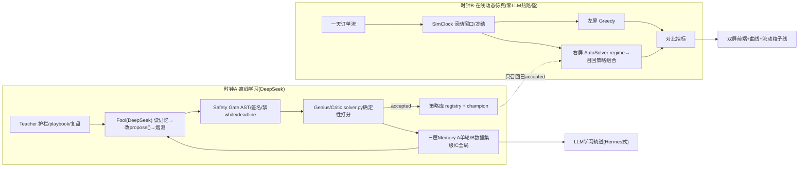

# 会议明确有用点 · 详细执行方案 v4（LLM 大改版 · DeepSeek）

> 日期：2026-06-25
> 基准项目：`/Users/比赛/美团黑客松决赛/AI-Hackahton_meituan_logg_在这版上面改`
> 参考项目（港队 MTASA）：`/Users/比赛/美团黑客松决赛/MTASA`
> 上一版：`/Users/比赛/美团黑客松决赛/AI-Hackahton_meituan_logg_在这版上面改/docs/会议明确有用点_详细执行方案_v3_LLM大改版_20260625.md`
> 本 v4 相对 v3 改三处（其余沿用 v3，不改原文件，正式 `solver.py` 热路径零改动）：
> 1. **LLM 接 DeepSeek**（不再默认 Claude），落到具体 endpoint/模型/key（§5.6）。
> 2. **动态求解补成"算法级具体方案"**——数据结构 + 逐 tick 主循环 + 骑手移动/ETA 公式 + 订单到达合成 + 双泳道同源协议 + 事件触发重算 + 指标公式（§6，全部对到现有可复用函数）。
> 3. **前端"自主学习"补成"可实现的 Hermes 式具体方案"**——面板组件 + SSE 事件 schema + 数据来源 + 渲染行为 + lineage 图（§7B）。

---

## 0. 一分钟看懂这版

- **真接 DeepSeek 跑 LLM 自进化闭环**（命中会议 #4 + #2）：DeepSeek 在**离线**一轮轮改 `propose()` 策略 → 安全门 → 确定性 Critic 打分 → 写三层 memory，跑出真实"失败→修复→accepted"链（顺手拆掉 `accepted=0` 的雷）。
- **两个时钟**守诚实底线：时钟 A（离线·真 LLM）= 学习的过程；时钟 B（现场·零 LLM）= 学习的结果。现场不改 solver、不联网。
- **动态求解 = 滚动时域控制**，本版给出可直接写代码的具体方案（§6）。
- **前端自主学习 = Hermes 式证据流**（不是"AI 正在思考"的空动画），本版给出可直接写代码的组件与事件（§7B）。
- 被采纳路径用图一红框那种**发光流动粒子线**（真代码移植，§8）。

---

## 1. 会议四点 → 落地映射（同 v3，浓缩）

| 会议点 | 本方案落地 | 章节 |
|---|---|---|
| #1 动态仿真（时间轴/骑手移动/订单产生/不同时间片鲁棒性） | 感知驱动滚动时域引擎 + SimClock + 一天订单分布 + Peak Shock，**算法级方案见 §6** | §6 |
| #1 指标可视化（打分→业务指标） | `business_metrics_v4.py`：成本/ETA/准时率/覆盖率（ETA 独立于成本函数，§6.7） | §6.7 |
| #1 对比式可视化（左基线/右优化/下方曲线） | 双屏地图 + 底部冷暖三泳道曲线 | §7A |
| #2 自主策略设计（几个 agent/memory/交互） | 四角色 Genius/Fool/Teacher/Frontend + 三层 memory + LLM 闭环 | §4 §5 |
| #3 前端展现求解结果好不好 | 双屏 + 顶部判决卡 + 流动粒子线收束 | §7A |
| **#3 前端展现自主学习过程+结果（Hermes 式）** | **学习轨道证据流 + 学习曲线 + lineage 图，具体方案见 §7B** | §7B |
| #4 接 LLM 思路（港中文 MTASA 就这么做） | 真接 **DeepSeek**，Fool/Genius/Teacher 工具闭环离线进化 | §5 |
| 路线视觉（图一红框） | 四层叠加发光流动粒子线（真代码移植） | §8 |

---

## 2. 两个时钟（诚实框架，照讲不翻车）

```text
时钟 A · 学习时钟（离线，赛前发生，单位=轮 round）
  DeepSeek 在隔离实验轨道里一轮轮：读记忆→改 propose()策略代码→本地烟测→Critic打分→写记忆。
  产物：真实策略进化 lineage（v001失败→v002修复→v003 accepted，成本下降），落盘 llm_memory/。
  = "自主学习的过程"。可录屏、可回放、可审计；现场不依赖网络。

时钟 B · 调度时钟（在线，现场演示，单位=仿真分钟）
  动态仿真推进一天订单流；每 tick 按场景画像，从"时钟A学好并通过Critic的策略库"安全召回策略组合，滚动求解。
  = "学习的结果"。左右双屏证明召回了好策略的 AutoSolver 比固定 Greedy 更稳。
```

一句话挡所有追问："学习在离线发生（时钟 A），现场只做安全召回（时钟 B）——线上系统永远不会让 LLM 实时改正在跑的求解器。"

---

## 3. 现有家底（带真行号，answer 别凭空说）

| 能力 | 位置（绝对路径 / 行号） | 复用方式 |
|---|---|---|
| 正式求解器入口 | `/Users/比赛/美团黑客松决赛/AI-Hackahton_meituan_logg_在这版上面改/solver.py:19 solve(input_text)` | 只读复用，右屏核心求解器 + fallback，不改。 |
| 贪心基线 | `solver.py:1661 _fallback_official_greedy(candidates)` | 左屏 baseline。 |
| 统一成本口径 | `solver.py:1647 _solution_expected_cost(result, candidates, all_tasks)` | 成本只走这条；ETA 不走它（§6.7）。 |
| 场景识别 | `tools/agent_trace_demo.py:102 infer_regime(...)`（tiny/small/medium/large/scarce/low-willingness） | 每 tick 感知层直接调它。 |
| 输入解析 | `tools/agent_trace_demo.py:79 parse_candidates(text)` | 子算例构造用它。 |
| 解校验/统计 | `tools/agent_trace_demo.py:125 summarize_solution(...)` | Critic/覆盖率用它。 |
| Agent 编排 + 事件流 | `autosolver_agent/system.py:371 run_agent(input_text, case_id, budget_s, observer)` | 右屏 Agent 机制区数据源。 |
| 真实事件名 | `system.py`：`perception`(:409)/`critic_policy`(:412)/`round_start`/`attempt_start`/`attempt_result`/`best_update`/`adapt`/`evolution_generate`/`evolution_validate`/`evolution_trial`/`evolution_recall`/`evolution_promote`/`evolution_rollback`/`final` | 映射前端时间线，不造新事件名。 |
| 策略生成+沙箱+registry+memory | `autosolver_agent/evolution.py`：`generate_strategy`:60 / `safety_check`:94 / `run_generated_strategy`:116 / `trusted_strategies`:160 | **接 LLM 的天然落点**：换"生成层"，沙箱/打分/记忆全复用。 |
| 进化状态落盘 | `autosolver_agent/evolution_state/`：`generated_strategies/*.py`、`evolution_memory.jsonl`、`strategy_registry.json`（当前全 accepted=0） | L1/L2 memory 真实文件。 |
| 安全门白/黑名单 | `evolution.py:15 ALLOWED_IMPORTS`/`:16 BLOCKED_CALLS`/`:17 BLOCKED_ATTR_ROOTS`；签名 `propose(candidates, all_tasks, deadline, helpers)` | 复用并增强。 |
| 坐标合成（演示用） | `web_agent_demo/server.py:82 _stable_point(entity_id, lane)`（SHA1 → (x,y)∈大致[7.5,92.5]） | 动态仿真商家/骑手初始坐标，打"演示"角标。 |
| 地图/路线 payload | `web_agent_demo/delivery_routes_clone.py: autosolver_map_payload()` | 拿路线点 `route.points`。 |
| **流动粒子线成品** | `/Users/比赛/美团黑客松决赛/AI-Hackahton_meituan_提交版原版/web_agent_demo/static_rg/app.js:765-944`（`smoothPath`:779/`cometAlong`:798/hero四层:928-941；副本在 `_claude_v19` 同路径） | 移植到 `flow_route_v4.js`（§8）。本项目里没有 app.js。 |
| 唯一干净算例 | `data/official_cases/large_seed301.txt`（40 任务×80 骑手，33779 候选行；贪心 2097.658→求解 657.104，−68.7%） | 动态仿真主算例。 |
| MTASA DeepSeek 客户端 | `/Users/比赛/美团黑客松决赛/MTASA/fool/llm_client.py`（多 provider，含 deepseek；`_resolve_chat_endpoint`/`_apply_effort_to_payload`） | 移植成 `llm_client_v4.py`。 |

---

## 4. 总体架构（四角色 + 三层 memory + 两个时钟）



四角色 → 真实模块：Genius=`autosolver_llm_v4/genius_v4.py`（封 `_solution_expected_cost`+`summarize_solution`）；Fool=`harness_v4.py`+`tools_v4.py`；Teacher=`teacher_v4.py`+`teacher_playbook_v4.md`；Frontend=`web_agent_demo/server_v4.py`+`static/*_v4.js`。工程实情：一个统一控制器编排四个**逻辑角色**，不虚构多进程。

---

## 5. LLM 自主学习闭环（DeepSeek）

### 5.1 LLM 改 `propose()` 而不是改 `solver.py`
`solver.py` 是 10 秒预算高度压缩的热路径，让 LLM 直接改风险极高。第一阶段 DeepSeek 只生成/改一个受限策略模块：
```python
def propose(candidates, all_tasks, deadline, helpers):
    return [(task_key, [courier_id, ...]), ...]   # 必须 list[tuple[str, list[str]]]
```
这正是 `EvolutionManager.run_generated_strategy()`（`evolution.py:116`）已支持的签名——沙箱/打分/registry/memory 全现成，只换生成层。

### 5.2 单轮 `run_round()`（对标 MTASA `runner.py:321`）
```text
messages=[system_prompt(teacher), round_header(state, memory)]; draft=best_propose或模板; pending_smoke=False
while step<max_steps(40):
  raw = deepseek.complete(messages, max_tokens=8000)         # 唯一一次LLM调用/步
  intent,kind,payload = parse(raw)                            # kind∈{tool,final,retry}
  if kind in(tool,final) and not intent: push("先补<intent>:做什么/为什么/期望信号"); continue
  if kind==tool:
     result=tools.run(name,args); push(format(result))
     if name in{draft_strategy,patch_strategy}: pending_smoke=True
     if name==smoke_test_strategy: pending_smoke=False
     continue
  if kind==final:
     if pending_smoke: push("改完必须先 smoke_test_strategy"); continue   # smoke gate
     if final_guard(plan)==violations: push(feedback); continue           # 一致性guard
     return draft_code, plan
raise HarnessFailure   # 本轮记 try_error
```
外层多轮（时钟 A，`evolution_runner_v4.py`）：`run_round → 重复检测 → genius判 → classify(improved/neutral/regressed) → 写episode → improved则promote+写lesson, 否则写try_error → 停滞触发teacher_review`。

### 5.3 三层 memory（落盘，桥接现有 `evolution_state/`）
| 层 | 存什么 | 落盘 |
|---|---|---|
| A 单轮 | 本轮对话/工具调用/大输出索引 | `llm_runs/<run_id>/round_NNN/dialog.jsonl` + `tool_results/<uuid>.txt` |
| B 数据集级 | 同算例/同 regime 的 episodes/索引/桶冠军 | `llm_memory/runs/<dataset_fp>/episodes.jsonl`/`strategy_index.json`/`buckets/<regime>/champion.py`；桥接 `evolution_state/evolution_memory.jsonl`+`strategy_registry.json` |
| C 全局 | 跨算例 lesson/try_error/key_decision（BM25） | `llm_memory/MEMORY.md`+`llm_memory/notes/{lesson,try_error,key_decision}_*.md` |

检索用轻量纯 Python BM25（关键词 + regime 标签重叠 + 最近收益加权），不引向量库。

### 5.4 Fool 工具集（= 安全边界）
`profile_case` / `read_teacher_checklist` / `memory_search` / `memory_get` / `list_strategy_templates` / `read_current_best_strategy` / `draft_strategy` / `patch_strategy` / `smoke_test_strategy`。
安全门 `sandbox_v4.py`（复用增强 `evolution.py:94`）：白名单 import、禁 eval/exec/open/subprocess、**新增**禁 `while True`、强制 deadline 检查、强制签名与返回类型。

### 5.5 Genius/Critic（确定性，不让 LLM 自评）
输出 `{valid,accepted,reason,baseline_cost,candidate_cost,coverage,elapsed_ms,regime}`；判定=合法+覆盖不降+不超时+`candidate≤baseline−ε`。打分只走 `solver.py:1647`。

### 5.6 ⭐ DeepSeek 接入（本版改动点）
DeepSeek API 与 OpenAI **完全兼容**（`/chat/completions`），MTASA 客户端已支持，移植极简。`llm_client_v4.py` 默认配置：

```python
# llm_client_v4.py 默认 provider = "deepseek"
DEEPSEEK = {
    "api_type": "deepseek",                 # OpenAI 兼容
    "base_url": "https://api.deepseek.com",  # 兼容端点；也可用 https://api.deepseek.com/v1
    "endpoint": "/chat/completions",
    "api_key_env": "DEEPSEEK_API_KEY",       # 从环境变量读，不写进仓库
    "model_main": "deepseek-chat",           # DeepSeek-V3：策略生成/工具循环主力（支持工具/函数调用、快、便宜）
    "model_reason": "deepseek-reasoner",     # DeepSeek-R1：仅用于 final_guard / teacher_review 的深推理（慢，按需）
    "temperature": 0.4,                      # 策略生成留一点多样性
    "max_tokens": 8000,
}
```

要点：
1. **主循环用 `deepseek-chat`（V3）**：我们的工具协议是文本协议（`<intent>`/`<tool>`/`<final>`），`deepseek-chat` 跑得稳、成本低；不依赖原生 function-calling。
2. **`deepseek-reasoner`（R1）按需用在反思步**（final guard / teacher review）：它会返回 `reasoning_content`，可顺手把"思考链摘要"喂给前端学习轨道（§7B），但慢、贵，不放进每步主循环。
3. **key**：`export DEEPSEEK_API_KEY=sk-xxx`（建议写进 `~/.zshrc`，前端"检查 API"按钮可探活）。仓库只放 `config.example.json`，不放真 key。
4. **`FakeModelClient` 必带**：用预置脚本回放一轮"生成→失败→修复→accepted"，无 key/断网也能单测与现场演示。
5. 配置可切换：若要回退/对比，改 1 处 `provider` 即可切 openai/openrouter/claude。
6. 兼容性兜底：DeepSeek 偶发限流/超时 → 客户端做指数退避重试 + 失败回退 FakeModelClient，**绝不让现场卡死**。
> 注：DeepSeek 官方端点/模型名若有更新，以 https://platform.deepseek.com 文档为准；上面是当前通行配置。

### 5.7 跑出真实 accepted lineage（拆雷）
赛前：`python3 autosolver_llm_v4/evolution_runner_v4.py --provider deepseek --rounds 8 --case large_seed301`，目标在某 regime 上拿到 ≥1 条真实 `失败→修复→accepted（成本下降）` 链，落进 `llm_memory/` + `strategy_registry.json`。这是答辩"学习过程+结果"的硬证据，直接终结"假自进化"质疑。时间不够时 `FakeModelClient` 产结构完整 lineage，诚实标注"演示回放"。

---

## 6. 动态求解 —— 算法级具体方案（老师反复强调，本版重点补强）

> 这一节把"动态求解"从"概念/路由表"落到**能直接照着写代码**。核心思想 = **滚动时域控制（receding/rolling horizon）**：订单陆续到达、骑手不断移动、已派决策冻结、每 tick 只对滚动窗口重算。

### 6.1 为什么这才叫"动态"（对齐老师"你们是静态仿真"的批评）
静态 = 一次性拿到全部订单求一个解。**动态 = 满足以下四条**：
1. **信息逐步揭示**：订单按 `arrival_min` 陆续出现，决策时只能看到"已到达且未派"的订单。
2. **环境随时间变化**：骑手在 tick 之间**物理移动**，位置/可用时间/状态实时更新。
3. **决策不可撤销**：已派出的订单**冻结**，不能反悔重派（真实约束）。
4. **滚动重算**：每 tick 只对"当前可决策窗口"重新求解，复用剩余预算。
四条齐了，才是老师要的"有时间轴、车在动"的动态求解。

### 6.2 输入合成：静态算例 → 动态实例（`order_stream_v4.py` + `scenario_builder_v4.py`）
`large_seed301` 给的是 40 个任务、80 个骑手、33779 行候选 `(task子集, courier, score, willingness)`。动态化需补三组合成字段（**全部打"演示合成"角标**，§11 红线）：

```python
# 1) 订单到达分布：一天 0..T 分钟（演示可压成 T=240），三峰
def synth_arrival(order_idx, T=240):
    # 早高峰 ~0.25T、午高峰 ~0.5T、晚高峰 ~0.8T，平峰稀疏；用确定性伪随机(seed=order_idx)保证可复现
    peaks=[(0.25*T,0.06*T,0.45),(0.50*T,0.05*T,0.35),(0.80*T,0.06*T,0.20)]
    return int(sample_mixture_gaussian(peaks, seed=order_idx))     # 确定性

# 2) 截止时间：到达 + 服务窗（高峰更紧）
def synth_deadline(arrival, regime_hint): return arrival + (30 if regime_hint!='peak' else 25)

# 3) 坐标：复用 server.py:82 _stable_point(entity_id) 拿商家/骑手初始 (x,y)∈[7.5,92.5]
pickup_xy  = _stable_point(merchant_id, 0)
dropoff_xy = _stable_point(order_id, 1)
courier_xy = _stable_point(courier_id, 2)
```

确定性是关键：同一 seed → 同一订单流，现场可复现、断网可回放、左右双屏天然同源。

### 6.3 状态模型（`sim_state_v4.py`，可直接写成 dataclass）
```python
@dataclass(frozen=True)
class SimOrder:
    order_id: str; task_key: str
    arrival_min: int; deadline_min: int
    pickup_xy: tuple; dropoff_xy: tuple

@dataclass
class SimCourier:
    courier_id: str
    xy: tuple                # 当前位置，每 tick 更新
    status: str              # 'idle' | 'to_pickup' | 'to_dropoff'
    free_at_min: int         # 当前任务完成时刻；idle 时 = 当前时刻
    current_order: str|None

@dataclass
class OrderRuntime:          # 每条订单的运行态（左右泳道各一份）
    status: str              # 'hidden'|'pending'|'assigned'|'enroute'|'delivered'|'late'
    courier: str|None; assign_min: int|None; eta_min: int|None

@dataclass(frozen=True)
class DynamicSolveStep:      # 每 tick 每泳道一条，前端播放的最小单元
    tick: int; clock_min: int; lane: str; regime: str
    decision_window: list[str]      # 本 tick 开放决策的 order_id
    frozen: list[str]               # 已冻结（不可再派）
    new_assignments: list[dict]     # 本 tick 新派 {order, courier, route_points, cost, eta, willingness}
    metrics: dict                   # 见 §6.7（瞬时+累计）
    agent_events: list[dict]        # 本 tick 的 perception/planner/critic 事件（右泳道才有）
    commentary: str|None            # tick 级 LLM 调度解说（§6.6①），现场回放
```

### 6.4 逐 tick 主循环（`rolling_solver_v4.py`，这就是"动态求解"的核心算法）
```text
SimClock t=0, 步长 Δ=10 分钟, 决策视野 H=30 分钟
init: 80 骑手 idle 于合成初始坐标; 40 订单 status='hidden'
两份独立运行态: state_left(Greedy) / state_right(AutoSolver)   # 同输入、独立提交，互不影响

for t in range(0, T, Δ):
  for state, solver in [(state_left, greedy), (state_right, autosolver)]:
    # ① 环境推进（"车在动" + "决策不可撤销"）
    advance_couriers(state, Δ)         # 见 §6.5：沿路线移动 v·Δ；到达 dropoff 的订单 delivered；释放骑手
    reveal = [o for o in orders if t-Δ < o.arrival_min <= t]
    for o in reveal: state.rt[o].status='pending'         # 订单到达，进入可决策

    # ② 构造滚动窗口（receding horizon）
    window = [o.order_id for o in orders
              if state.rt[o].status=='pending' and o.arrival_min<=t and o.deadline_min<=t+H]
    frozen = [o.order_id for o in orders if state.rt[o].status in ('assigned','enroute','delivered')]
    avail  = [c for c in couriers if c.status=='idle' or c.free_at_min<=t+Δ]

    # ③ 感知 regime（复用 infer_regime）
    regime = infer_regime(window_features(window, avail))   # tools/agent_trace_demo.py:102

    # ④ 构造"子算例"= 候选行 ∩ (window 订单 × avail 骑手)
    sub_text = build_subcase_text(large_seed301_rows, window, avail)   # 复用候选行格式，过滤后重拼

    # ⑤ 求解（左右用同一 sub_text，受控对比）
    if solver is greedy:
        sol = _fallback_official_greedy(parse_candidates(sub_text))    # solver.py:1661
    else:
        regime_combo = scene_memory.recall(regime)        # 暖启动: 从已accepted策略库召回组合; 冷启动: 空→默认组合
        sol = run_agent(sub_text, case_id='dyn', budget_s=min(Δ_budget, remaining)).best   # system.py:371
        # 异常/超时 → 回退 solver.solve(sub_text)，绝不中断演示

    # ⑥ 提交并冻结（不可撤销）
    for (task_key, courier_id) in sol:
        o = order_of(task_key)
        state.rt[o]=assigned(courier_id, t); freeze(o)
        c=courier_of(courier_id); c.status='to_pickup'; c.current_order=o.order_id
        c.free_at_min = t + travel_time(c.xy,o.pickup_xy) + travel_time(o.pickup_xy,o.dropoff_xy)
        eta = c.free_at_min; state.rt[o].eta_min=eta; mark_late_if(eta>o.deadline_min)

    # ⑦ 记录指标 + 事件（§6.7）
    step = DynamicSolveStep(tick=t//Δ, clock_min=t, lane=state.lane, regime=regime,
                            decision_window=window, frozen=frozen,
                            new_assignments=routes_of(sol), metrics=metrics(state,t),
                            agent_events=agent_events if state.lane=='right' else [],
                            commentary=commentary(regime, sol, metrics) if state.lane=='right' else None)
    emit(step)
```

三泳道版（B+，§7A 底部曲线）= 跑 **三份独立 state**：`Greedy / AutoSolver冷(scene_memory空) / AutoSolver暖(scene_memory带已accepted)`，第④⑤步同 `sub_text`，唯一变量是 `scene_memory.recall` 有没有内容。

**这一段就是答辩时"动态求解具体怎么做"的标准答案**：信息逐步揭示（①reveal）+ 骑手移动（①advance）+ 滚动窗口（②）+ 感知选策略（③）+ 同源求解（④⑤）+ 冻结不可撤销（⑥）。

### 6.5 骑手移动与 ETA（几何，独立于成本函数——§11 红线）
```python
SPEED = 4.0            # 归一化网格单位/分钟（演示参数，可调）
def dist(a,b): return ((a[0]-b[0])**2+(a[1]-b[1])**2)**0.5
def travel_time(a,b): return dist(a,b)/SPEED                # 分钟
def advance_couriers(state, dt):
    for c in state.couriers:
        if c.status=='idle': continue
        # 沿 当前段(到pickup→到dropoff) 走 SPEED*dt；走到则切换状态/标记送达；释放
        c.xy = step_along_segment(c.xy, target_of(c), SPEED*dt)
        if reached(c): advance_courier_stage(c, state)      # to_pickup→to_dropoff→idle(delivered)
```
ETA = 接单时刻 + `travel_time(骑手→商家) + travel_time(商家→顾客)`。**ETA 永远走几何，不调 `_solution_expected_cost`**，防"成本和 ETA 同一根公式自圆其说"。

### 6.6 ⭐ 让 LLM 进动态因果（三条增强，优先级 ①→③→②）
- **① tick 级 LLM 调度解说 Critic**（`dispatch_commentator_v4.py`）：每次 regime 切换调一次 DeepSeek，输入"场景画像+选了哪套策略+指标变化"，产一句自然语言解说+风险提示（"午高峰密度↑意愿↓→切 pair_matching+production_solver；准时率有 6% 下行风险，已提高多派阈值"）。**只解说不决策**；现场放 FakeModelClient 回放。→ 让前端"自主学习"有真 LLM 文本在跑（§7B 用）。
- **② 仿真停滞 → 触发离线 Teacher Review → 产新策略 → 下次回放被召回**：某 regime 连续 N tick 无改善（如 Peak Shock 后准时率掉），把该 regime 失败画像喂时钟 A，离线生成针对性新策略，过 Critic accepted 后入库；**下次回放暖泳道在该时段明显追上**。形成"仿真暴露弱点→LLM 学新策略→仿真验证变好"的因果闭环（冲击最强，工作量最大）。
- **③ 两时钟同屏**：前端头部"学习时钟"缩略图（时钟 A 进化曲线），点某一轮 → 高亮"那轮学到的策略在调度时钟（时钟 B）哪个时间段被召回、带来多少改善"。

### 6.7 业务指标（`business_metrics_v4.py`，被追问不翻车）
| 指标 | 公式/来源 | 备注 |
|---|---|---|
| `expected_cost` | `solver.py:1647 _solution_expected_cost` | 叫"每单期望成本"，不冒充官方分。 |
| `avg_eta_min` | mean(ETA)，ETA=几何 travel_time（§6.5） | **独立于成本**。 |
| `on_time_rate` | `#(eta≤deadline) / #已派` | deadline 合成，需角标。 |
| `coverage_rate` | `#已派 / #活跃订单`（活跃=已到达未过期） | 最易懂。 |
| `regime_hit_rate` | 暖泳道命中数/总判定（命中=该 regime 召回到 accepted 策略） | "自主学习"量化曲线（§7B）。 |
| `accept_risk` | `1−∏(1−wᵢ)`（子模，非 Σp） | 低/中/高。 |
| `solve_latency_ms` | 每 tick 实际耗时 | 证明动态可实时。 |

### 6.8 Peak Shock 演练（保留）
午高峰注入突发冲击（如 0.5T 处局部雨天 → 意愿↓、ETA↑）。感知层切低意愿/稀缺策略，曲线显示"扰动—恢复"，也正好是 §6.6② 的触发场景。

---

## 7A. 对比式可视化（双屏 + 冷暖三泳道曲线）

页面布局（地图只两张，避免老师批"信息密度低看不清"；策略/推理放侧栏）：
```text
┌ 顶部判决卡：AutoSolver vs Greedy  每单成本/平均ETA/准时率/覆盖率/耗时  · 右上角小窗：学习时钟(时钟A缩略) ┐
├ 左屏 Greedy（弱发光静态①②层路线）        │ 右屏 AutoSolver（发光流动粒子线①②③④全开，§8） ┤
├ 底部曲线：订单到达量/成本/ETA/准时率/覆盖率 · 三泳道 Greedy(橙)/冷(蓝)/暖(青绿) + 命中率(副轴细线) ┤
├ 侧栏A Agent机制区(真实事件名) · 侧栏B LLM学习轨道(§7B) · tick级LLM调度解说滚动                        ┤
```
现场 60 秒讲法见 v3 §7.2（沿用）。API（`server_v4.py`，不改 `server.py`）：`/api/v4/dynamic/run?case=large_seed301`（一次性返回所有 step，前端本地播放，先不做 SSE）、`/api/v4/dynamic/stream`（可选 SSE）、`/api/v4/llm/runs`、`/api/v4/llm/stream`、`/api/v4/memory/search`。

---

## 7B. 前端"自主学习"展示 —— Hermes 式具体方案（本版重点补强）

> 老师红标 30:33："展现学习的**过程**和**结果**，用 hermes 那一套前端展示。" 核心原则：**展证据，不展空动画**——不要"AI 正在思考…"的转圈，要把每轮真实发生的 假设/工具调用/代码 diff/打分/记忆写入 像聊天流一样逐条流式展开、每条都能点开看原始证据。

### 7B.1 面板总览（`llm_trace_v4.js`，三区）
```text
┌ 区1 · 学习时间带 Learning Ribbon ────────────────────────────────────────────┐
│ R1 ■绿  R2 ■灰  R3 ■红  R4 ■绿(accepted)  R5 ■暗(duplicate) ...  ← 点任一轮展开区2 │
├ 区2 · 本轮证据流 Round Stream（Hermes 思路流，选中轮的逐条事件）──────────────┤
│  💭 intent     本轮假设：低意愿尾段用 sparse_cover 替 greedy，期望覆盖↑成本↓     │
│  🔧 tool       memory_search("low-willingness") → 命中 try_error#7 / lesson#3   │
│  🔧 tool       draft_strategy(propose v004)  [点开看代码]                       │
│  🟩🟥 diff      propose() SEARCH/REPLACE 高亮（红删绿增）                        │
│  🛡 safety     AST 安全门 PASS（白名单 import / 有 deadline 检查）              │
│  🧪 smoke      合法 ✓  本地成本 661.3  耗时 78ms                                │
│  ⚖ judge      Genius: baseline 700.0 → candidate 657.1  覆盖 40/40  ACCEPTED   │
│  🧠 memory     写 lesson："low-w 场景 sparse_cover 优于 greedy 尾段(−6%)"        │
├ 区3 · 学习成效 Outcomes（两条曲线 + 一张谱系图）──────────────────────────────┤
│  📉 best-so-far 阶梯线（学习结果）   📈 regime命中率曲线（学习过程，来自时钟B暖泳道）│
│  🌳 lineage 谱系图：v001✗→v002✗(超时)→v003✗(劣化)→v004✓accepted→v005✓(promoted) │
└──────────────────────────────────────────────────────────────────────────────┘
```

### 7B.2 每个组件：渲染行为 + 数据来源（可直接照写）
| 组件 | 渲染行为 | 数据来源（真实落点） |
|---|---|---|
| **学习时间带** | 每轮一个 chip，按 outcome 上色：improved=绿/neutral=灰/regressed=红/duplicate=暗。当前轮高亮。点击切换区2。 | `llm_memory/runs/<fp>/episodes.jsonl` 每行 `{round,outcome,score}` |
| **intent 气泡** | 流式打字机追加（Hermes 感来源），≤300 字 | A 层 `dialog.jsonl` 的 `<intent>` |
| **tool 行** | 可折叠：标题=工具名+一句话参数，展开=截断结果（>3KB 存 `tool_results/<uuid>.txt`，给"展开续读"） | A 层 transcript |
| **code diff** | 双色高亮 SEARCH/REPLACE；只显示改动块 | `draft_strategy/patch_strategy` 的 patch |
| **safety 徽标** | PASS/FAIL + 原因 | `sandbox_v4.safety_check` 返回 |
| **smoke 徽标** | 合法?/成本/耗时 | `run_generated_strategy` 轻量模式 |
| **judge 卡** | baseline→candidate 数字 + 覆盖 + ACCEPTED/REJECTED + 原因，箭头动效 | `genius_v4.judge()` 返回 |
| **memory chip** | 写了哪条 note（section+标题），点开看正文 | `llm_memory/notes/*.md` |
| **best-so-far 阶梯**（结果） | 每次 accepted 后成本下降的阶梯折线 | episodes 里 accepted 轮的 score |
| **regime 命中率**（过程） | 随时钟 B 推进上爬的细折线 | `business_metrics_v4` 的 `regime_hit_rate` |
| **lineage 谱系图** | 小 DAG：节点=策略版本(v00x)，边=accept/reject/promote；失败节点标原因(超时/劣化/非法) | `strategy_registry.json` 的 `target_regime/accepted/rejected/last_reason/lineage` |

### 7B.3 SSE 事件 schema（`/api/v4/llm/stream`，现场放 FakeModelClient 录像）
前端按到达顺序逐条渲染到区2（这就是 Hermes 式"流"的实现）：
```jsonc
{"type":"round_start","round":4,"regime":"low-willingness"}
{"type":"intent","round":4,"text":"低意愿尾段用 sparse_cover 替 greedy……"}
{"type":"tool","round":4,"name":"memory_search","args":"low-willingness","result":"命中 try_error#7 / lesson#3","uuid":"a1b2"}
{"type":"tool","round":4,"name":"draft_strategy","args":"propose v004","result":"written 1.2KB"}
{"type":"patch","round":4,"diff":"@@ ... - greedy_tail() + sparse_cover_tail() ..."}
{"type":"safety","round":4,"ok":true,"reason":"imports ok; deadline checked"}
{"type":"smoke","round":4,"legal":true,"cost":661.3,"elapsed_ms":78}
{"type":"judge","round":4,"baseline":700.0,"candidate":657.1,"coverage":"40/40","accepted":true,"reason":"improved expected cost"}
{"type":"memory","round":4,"section":"lesson","title":"low-w: sparse_cover>greedy尾段(-6%)"}
{"type":"round_end","round":4,"outcome":"improved","best_so_far":657.1}
```
（若用 `deepseek-reasoner`，可多一条 `{"type":"reasoning","round":4,"text":"<R1思考链摘要>"}`，前端淡灰小字显示，凸显"它真的在推理"。）

### 7B.4 三处"过程↔结果"对应（直接回答老师"过程和结果"）
- **过程**：学习时间带（一轮轮在变色）+ 区2 证据流（每轮怎么想、怎么试、怎么被判）+ regime 命中率上爬。
- **结果**：区3 best-so-far 阶梯下降 + lineage 终点的 accepted/promoted 节点 + 时钟 B 暖泳道最终更优。
- **过程→结果的因果**：点学习时间带某轮 → 联动高亮"这一轮学的策略在时钟 B 哪个时段被召回、带来多少改善"（§6.6③）。

### 7B.5 实现约束（直接抄）
1. 纯原生 JS（与现有 server.py 内联风格一致，不引框架），SSE 优先、轮询兜底（对标 MTASA frontend）。
2. 现场默认放 `llm_runs/` 录像（FakeModelClient），**断网/无 key 也能完整演示学习过程**。
3. intent/tool 用"流式追加 + 折叠证据"，**禁止**用无内容的"AI 正在思考"转圈（老师否决空动画）。
4. 大输出（>3KB）落 `tool_results/<uuid>.txt`，前端给"展开续读"，避免页面爆量。

---

## 8. 流动粒子线（图一红框）—— 四层叠加 + 真代码移植

四层叠加（核对源 `提交版原版/web_agent_demo/static_rg/app.js:928-941`）：① 发光底 `rgba(28,244,210,.2)` w7.5 `filter url(#glow)`；② 青主线 `#1cf4d2` w3.4 `marker-end url(#arrow)`；③ 流动虚线 `dasharray "0.1 10"` + `animate stroke-dashoffset 0→-10.1` dur0.8s（**流动感**）；④ 彗星粒子 `cometAlong()` 亮头+2段渐隐拖尾 `animateMotion` 错开 begin（**粒子感**）。移植成 `web_agent_demo/static/flow_route_v4.js` 的 `renderFlowRoute(layer, points, opts)`，注入 `<defs>`（glow/pinGlow/arrow，源 :854-865）。代码整段见 v3 §8.2（沿用，只把文件名改 v4）。
约束：只给右屏 selected 路线开 ③④；左屏只 ①②；`prefers-reduced-motion` 自动关粒子；SVG 色值不能用 `var()` 写具体值；路线点来自 `delivery_routes_clone.py: autosolver_map_payload()`。

---

## 9. 新建文件清单（全绝对路径，全部新建，不改原文件；根 = `/Users/比赛/美团黑客松决赛/AI-Hackahton_meituan_logg_在这版上面改/`）

**LLM 轨道（时钟A）**：`autosolver_llm_v4/{__init__,llm_client_v4(DeepSeek+Fake),harness_v4,tools_v4,sandbox_v4,genius_v4,teacher_v4,memory_v4,evolution_runner_v4,dispatch_commentator_v4}.py` + `teacher_playbook_v4.md`
**动态仿真（时钟B）**：`autosolver_dynamic_v4/{order_stream_v4,sim_state_v4,rolling_solver_v4,scene_memory_v4,business_metrics_v4,scenario_builder_v4}.py`
**前端**：`web_agent_demo/server_v4.py` + `web_agent_demo/static/{dashboard_v4.js,flow_route_v4.js,flow_route_v4.css,llm_trace_v4.js,charts_v4.js}`
**测试/文档**：`tests/test_{llm_client,llm_harness,sandbox,memory,genius,dynamic_sim,dynamic_compare,scene_memory,flow_route}_v4.py` + `docs/{demo_runbook_v4,llm_agent_architecture_v4}.md`

---

## 10. 分阶段执行 + 验收命令

- **Phase 0** 新入口 `server_v4.py`（静态页+健康检查）+ 跑现有回归确认基线没坏。
- **Phase 1** `llm_client_v4`（DeepSeek + Fake）+ `harness_v4.run_round`。验收：无 key 跑 FakeModelClient 单测过。
- **Phase 2** `tools_v4`+`sandbox_v4`（禁 import/while/非法返回）。
- **Phase 3** `memory_v4` 三层落盘 + 桥接 `evolution_state/`。
- **Phase 4** `genius_v4` + `evolution_runner_v4 --provider deepseek --rounds 8` 跑真 DeepSeek 争取 ≥1 条 accepted lineage。
- **Phase 5** 动态仿真六件套（§6）：`order_stream/sim_state/rolling_solver/scene_memory/business_metrics/scenario_builder`。验收：高峰密度>平峰、冻结订单不被改派、同 tick 左右同源、异常回退不中断。
- **Phase 6** 双屏前端 + 三线曲线 + `/api/v4/dynamic/run`（本地播放）。
- **Phase 7** 流动粒子线（§8）+ tick 调度解说。
- **Phase 8** **`llm_trace_v4.js` 学习轨道（§7B）** + 录屏 + Q&A。

```bash
cd /Users/比赛/美团黑客松决赛/AI-Hackahton_meituan_logg_在这版上面改
export DEEPSEEK_API_KEY=sk-xxx   # 真跑时；FakeModelClient 不需要
python3 -m py_compile autosolver_llm_v4/*.py autosolver_dynamic_v4/*.py web_agent_demo/server_v4.py
python3 -m unittest discover -s tests -p "test_*_v4.py"
python3 autosolver_llm_v4/evolution_runner_v4.py --fake-model --rounds 3
python3 autosolver_llm_v4/evolution_runner_v4.py --provider deepseek --rounds 8 --case large_seed301
python3 web_agent_demo/server_v4.py --host 127.0.0.1 --port 8766
```

---

## 11. 诚实护栏（红线）
1. 两个时钟：学习离线（时钟A·DeepSeek），现场调度（时钟B）**热路径零 LLM**，`solver.py` 零改动。
2. LLM 产物只允许 sandbox 里的 `propose()`；不写正式 solver、不联网、不文件 IO、不 subprocess、不 eval/exec。
3. `657.104` 是本地口径（贪心 2097.658→657.104，−68.7%），不冒充官方 706.197。
4. 成本走 `solver.py:1647`，ETA 走几何（§6.5），两条独立路径。
5. `deadline`/坐标/ETA/订单到达是仿真合成层，一律打"演示"角标。
6. accepted lineage 区分"真 DeepSeek 跑出"与"FakeModelClient 回放"，不混。
7. Agent = 四角色由统一控制器编排，不虚构多进程。
8. tick 级 LLM 解说只解说不决策。

---

## 12. 风险与兜底
| 风险 | 兜底 |
|---|---|
| DeepSeek 限流/超时/无 key | 指数退避重试 → 失败回退 FakeModelClient 回放；单测不依赖 key。 |
| 跑不出真 accepted lineage | FakeModelClient 产结构完整 lineage（标"演示回放"）+ 把"安全门拒劣化策略"讲成质量门价值。 |
| 现场动态求解耗时不稳 | 预生成 trace JSON 本地播放，标"演示回放"。 |
| ETA/deadline 被质疑 | 明说合成、用于鲁棒性展示，不冒充官方指标。 |
| 追问"LLM 现场改 solver" | "两个时钟"一句话答（§2）。 |
| 粒子卡顿 | 只给 selected 开粒子，`prefers-reduced-motion` 自动关。 |
| 学习轨道/动态来不及 | 先两泳道双屏 + 流动粒子线（最小版已覆盖主诉求），§6.6 增强按 ①→③→② 补。 |

---

## 13. PPT 每页一句话 summary（沿用 v3 §13，新增一页）
P1 结果先行 / P2 动态求解（滚动时域：新单进入·旧决策冻结·窗口重算）/ P3 机制>算法 / **P4 真接 DeepSeek 自进化** / P5 三层 memory / P6 两个时钟（离线学·在线安全召回）/ **P7 自主学习同屏可见（学习轨道+冷暖曲线）** / P8 流动粒子线 / P9 扩展。每页一句话见 v3 §13。

---

## 14. 最小可交付保底顺序
1. `server_v4.py` 入口 → 2. LLM harness+Fake+工具展示 → 3. 复用 EvolutionManager 让 DeepSeek 生成 propose 过 Critic → 4. 三层 memory 最小版 → 5. 动态双屏 tick 播放（两泳道，§6）→ 6. 流动粒子线（§8）→ 7. **LLM 学习轨道（§7B）** + 60 秒讲稿。
做完即覆盖：动态仿真、对比可视化、真 LLM 自主策略、最终结果好不好、**自主学习过程+结果**、流动粒子线。有余力再加 §6.6 三条。

---

## 15. 决策（已据你反馈定）
| 决策 | 定 |
|---|---|
| LLM provider | **DeepSeek**（`deepseek-chat`/V3 主力，`deepseek-reasoner`/R1 用于反思步）；OpenAI 兼容，移植 MTASA 客户端即可；key=`DEEPSEEK_API_KEY`。 |
| 目录策略 | 就地新建 `*_v4`，不复制整仓，原文件零改动可回退。 |
| 现场是否真联网跑 LLM | 否，走 FakeModelClient 回放离线录像。 |
| §6.6 增强 | 至少做 ①tick 解说（性价比最高，喂 §7B 学习轨道）；②③ 时间够再上。 |

---

## 16. 一句话总纲
> 我们参考港队 MTASA 的 Genius/Fool/Teacher 四角色，用 **DeepSeek** 把项目升级为"离线自主学习 + 在线安全召回"的两时钟闭环：DeepSeek 离线一轮轮改策略代码、过安全门、由确定性 Critic 打分、沉淀进三层 memory，跑出真实"失败→修复→接受"链；动态仿真按滚动时域逐 tick 揭示订单、移动骑手、冻结决策、窗口重算，左右双屏 + 冷暖三泳道曲线证明 AutoSolver 更稳；前端用 Hermes 式证据流把"学习的过程和结果"同屏画出来，被采纳路径用发光流动粒子线呈现——既真接了 DeepSeek，又守住"现场不改 solver、不联网"的诚实底线。
